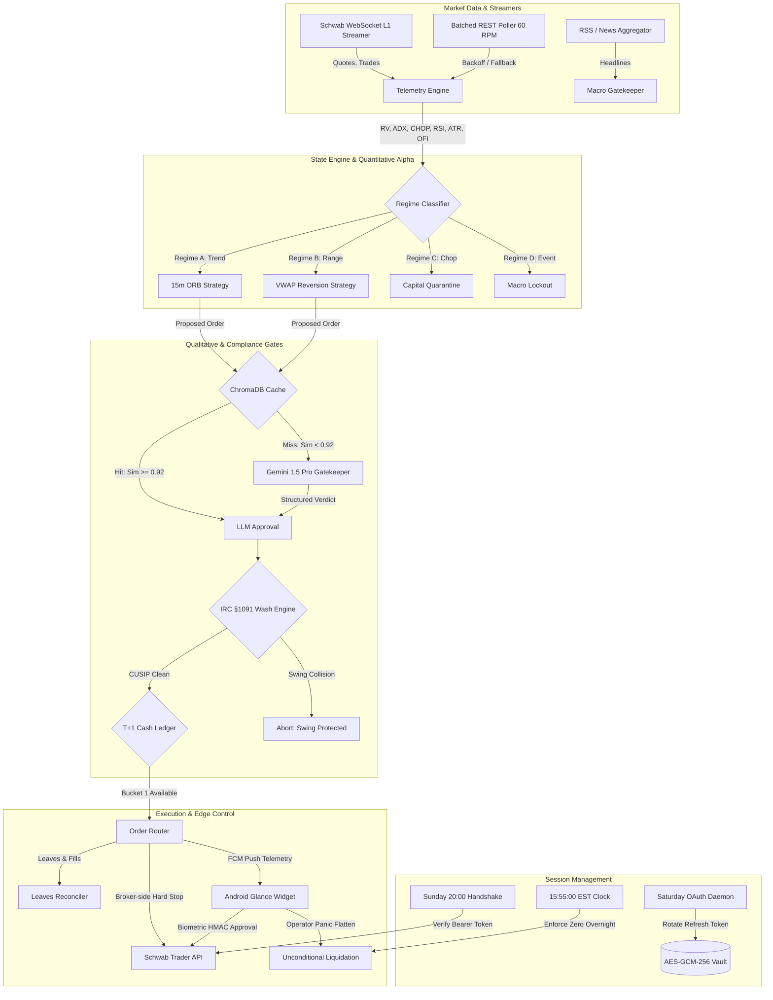
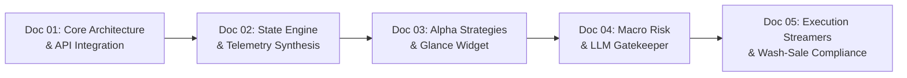

# Master Architectural Reference Index: Automated Day-Trading System on Schwab Trader API

This master reference index serves as the centralized technical catalog and architectural index for the five core design specifications governing the automated, single-account day-trading engine integrated with the Charles Schwab Trader API. It aggregates API mechanics, quantitative alpha strategies, state machine telemetry, macroeconomic risk firewalls, and low-latency execution resilience into a unified engineering reference.

---

## Document Catalog & Technical Summaries

### [1. Day-Trading Architecture & Execution Blueprint](file:///c:/Projects/schwab_engine/docs/01-day-trading-architecture.md)
**File**: [`docs/01-day-trading-architecture.md`](file:///c:/Projects/schwab_engine/docs/01-day-trading-architecture.md)  
**Overview**: Defines the foundational operational framework for running an automated intraday trading system on a cash account through the Schwab Trader API. It details OAuth 2.0 token management, account firewalling, and strict adherence to Federal Reserve Regulation T through an internal two-bucket cash ledger state machine. The document also specifies the baseline execution rules for 15-minute Opening Range Breakouts (ORB) and VWAP mean-reversion setups, complete with a daily circuit breaker and mandatory 15:55:00 EST flat-to-cash protocol.

#### Table of Contents
1. [1. API Integration Guide](file:///c:/Projects/schwab_engine/docs/01-day-trading-architecture.md#1-api-integration-guide)
   - [OAuth 2.0 Authentication Workflow and Headless Token Lifecycle](file:///c:/Projects/schwab_engine/docs/01-day-trading-architecture.md#oauth-20-authentication-workflow-and-headless-token-lifecycle)
   - [Account Whitelisting and Sandboxed Execution Firewall](file:///c:/Projects/schwab_engine/docs/01-day-trading-architecture.md#account-whitelisting-and-sandboxed-execution-firewall)
   - [Order Routing Schemas and Advanced Order Hierarchies](file:///c:/Projects/schwab_engine/docs/01-day-trading-architecture.md#order-routing-schemas-and-advanced-order-hierarchies)
   - [Deployment Topologies and Telemetry Notification Infrastructure](file:///c:/Projects/schwab_engine/docs/01-day-trading-architecture.md#deployment-topologies-and-telemetry-notification-infrastructure)
2. [2. Compliance Engine Logic](file:///c:/Projects/schwab_engine/docs/01-day-trading-architecture.md#2-compliance-engine-logic)
   - [Federal Regulation T and T+1 Settlement Mechanics](file:///c:/Projects/schwab_engine/docs/01-day-trading-architecture.md#federal-regulation-t-and-t1-settlement-mechanics)
   - [Internal Ledger State Machine Architecture](file:///c:/Projects/schwab_engine/docs/01-day-trading-architecture.md#internal-ledger-state-machine-architecture)
   - [Deterministic Compliance Decision Engine](file:///c:/Projects/schwab_engine/docs/01-day-trading-architecture.md#deterministic-compliance-decision-engine)
3. [3. Execution & Risk Matrix](file:///c:/Projects/schwab_engine/docs/01-day-trading-architecture.md#3-execution--risk-matrix)
   - [Quantitative Bankroll Quarantine and Position Sizing Formulas](file:///c:/Projects/schwab_engine/docs/01-day-trading-architecture.md#quantitative-bankroll-quarantine-and-position-sizing-formulas)
   - [Intraday Circuit Breaker and Drawdown Thresholds](file:///c:/Projects/schwab_engine/docs/01-day-trading-architecture.md#intraday-circuit-breaker-and-drawdown-thresholds)
   - [Intraday Execution Setups: 15-Minute ORB and VWAP Mean-Reversion](file:///c:/Projects/schwab_engine/docs/01-day-trading-architecture.md#intraday-execution-setups-15-minute-orb-and-vwap-mean-reversion)
   - [Hard Time-Stop Mechanics and Overnight Neutrality](file:///c:/Projects/schwab_engine/docs/01-day-trading-architecture.md#hard-time-stop-mechanics-and-overnight-neutrality)
4. [4. End-to-End Implementation Code](file:///c:/Projects/schwab_engine/docs/01-day-trading-architecture.md#4-end-to-end-implementation-code)

---

### [2. Hierarchical State Engine: Market Telemetry & Dynamic Adaptation](file:///c:/Projects/schwab_engine/docs/02-hierarchical-state-engine.md)
**File**: [`docs/02-hierarchical-state-engine.md`](file:///c:/Projects/schwab_engine/docs/02-hierarchical-state-engine.md)  
**Overview**: Formulates the hierarchical state engine responsible for synthesizing multi-variable market telemetry into discrete regime states. It specifies continuous tracking of normalized average true range, volume-weighted slope, relative volume, momentum Z-scores, and choppiness across the candidate universe. The engine maps these metrics into four distinct execution regimes (Regimes A through D) to dynamically adapt position sizing, stop-loss spacing, and mobile dashboard updates.

#### Table of Contents
1. [1. Identifying and Tracking Relevant Variables](file:///c:/Projects/schwab_engine/docs/02-hierarchical-state-engine.md#1-identifying-and-tracking-relevant-variables)
   - [Volume-Weighted Average Price Slope ($\Delta \text{VWAP}$)](file:///c:/Projects/schwab_engine/docs/02-hierarchical-state-engine.md#1-identifying-and-tracking-relevant-variables)
   - [Relative Volume (RVOL)](file:///c:/Projects/schwab_engine/docs/02-hierarchical-state-engine.md#1-identifying-and-tracking-relevant-variables)
   - [Normalized Average True Range ($\text{NATR}_{14}$)](file:///c:/Projects/schwab_engine/docs/02-hierarchical-state-engine.md#1-identifying-and-tracking-relevant-variables)
   - [Cross-Asset Momentum Z-Score ($Z_{\text{mom}}$)](file:///c:/Projects/schwab_engine/docs/02-hierarchical-state-engine.md#1-identifying-and-tracking-relevant-variables)
   - [Choppiness Index & Intraday Drawdown Ratio](file:///c:/Projects/schwab_engine/docs/02-hierarchical-state-engine.md#1-identifying-and-tracking-relevant-variables)
2. [2. Market Regime Classification Engine](file:///c:/Projects/schwab_engine/docs/02-hierarchical-state-engine.md#2-market-regime-classification-engine)
   - [Regime A: Trend Expansion (Breakout Active)](file:///c:/Projects/schwab_engine/docs/02-hierarchical-state-engine.md#2-market-regime-classification-engine)
   - [Regime B: Mean Reversion / Range-Bound Compression](file:///c:/Projects/schwab_engine/docs/02-hierarchical-state-engine.md#2-market-regime-classification-engine)
   - [Regime C: High-Noise / Illiquid Chop (Capital Quarantine)](file:///c:/Projects/schwab_engine/docs/02-hierarchical-state-engine.md#2-market-regime-classification-engine)
   - [Regime D: Circuit Breaker / Macro Volatility Lockout](file:///c:/Projects/schwab_engine/docs/02-hierarchical-state-engine.md#2-market-regime-classification-engine)
3. [3. Dynamic Restructuring and Adaptive Responses](file:///c:/Projects/schwab_engine/docs/02-hierarchical-state-engine.md#3-dynamic-restructuring-and-adaptive-responses)
   - [Volatility-Scaled Sizing and Adaptive Stops](file:///c:/Projects/schwab_engine/docs/02-hierarchical-state-engine.md#3-dynamic-restructuring-and-adaptive-responses)
4. [4. Telemetry Pipeline & Android Edge Interaction](file:///c:/Projects/schwab_engine/docs/02-hierarchical-state-engine.md#4-telemetry-pipeline--android-edge-interaction)
5. [Actionable Next Steps & Verification Checklist](file:///c:/Projects/schwab_engine/docs/02-hierarchical-state-engine.md#actionable-next-steps--verification-checklist)

---

### [3. Quantitative Strategy Optimization, Dynamic Restructuring & Edge Control](file:///c:/Projects/schwab_engine/docs/03-strategy-and-widget.md)
**File**: [`docs/03-strategy-and-widget.md`](file:///c:/Projects/schwab_engine/docs/03-strategy-and-widget.md)  
**Overview**: Delivers the quantitative models and edge control architecture for the trading engine, pairing an autonomous restructuring core with a native Android Jetpack Glance homescreen widget. It details the mathematical formulation of the Choppiness Index, rolling Realized Volatility, and the Quarter-Kelly criterion bounded by settled cash limits. It also provides the complete Kotlin implementation for bidirectional human-in-the-loop (HITL) order staging, panic-sweep triggers, and HMAC-signed execution directives.

#### Table of Contents
1. [1. Quantitative Strategy Specification and Alpha Generation Models](file:///c:/Projects/schwab_engine/docs/03-strategy-and-widget.md#1-quantitative-strategy-specification-and-alpha-generation-models)
   - [Intraday Market Regime Detection Framework](file:///c:/Projects/schwab_engine/docs/03-strategy-and-widget.md#intraday-market-regime-detection-framework)
   - [Strategy 1: Regime-Adaptive Volatility Breakout](file:///c:/Projects/schwab_engine/docs/03-strategy-and-widget.md#strategy-1-regime-adaptive-volatility-breakout)
   - [Strategy 2: VWAP-Band Dynamic Mean-Reversion](file:///c:/Projects/schwab_engine/docs/03-strategy-and-widget.md#strategy-2-vwap-band-dynamic-mean-reversion)
2. [2. Cross-Asset Momentum Scoring and Autonomous Portfolio Restructuring](file:///c:/Projects/schwab_engine/docs/03-strategy-and-widget.md#2-cross-asset-momentum-scoring-and-autonomous-portfolio-restructuring)
   - [Quantitative Cross-Asset Momentum Scoring Engine](file:///c:/Projects/schwab_engine/docs/03-strategy-and-widget.md#quantitative-cross-asset-momentum-scoring-engine)
   - [Capital Allocation and Drawdown Protection](file:///c:/Projects/schwab_engine/docs/03-strategy-and-widget.md#capital-allocation-and-drawdown-protection)
   - [Fractional Kelly Formulation for Cash Accounts](file:///c:/Projects/schwab_engine/docs/03-strategy-and-widget.md#fractional-kelly-formulation-for-cash-accounts)
   - [Volatility-Adjusted Trailing Stops for Leveraged Decay](file:///c:/Projects/schwab_engine/docs/03-strategy-and-widget.md#volatility-adjusted-trailing-stops-for-leveraged-decay)
   - [Equity Curve Drawdown Feedback Loop](file:///c:/Projects/schwab_engine/docs/03-strategy-and-widget.md#equity-curve-drawdown-feedback-loop)
3. [3. Telemetry Infrastructure and Push Notification Pipelines](file:///c:/Projects/schwab_engine/docs/03-strategy-and-widget.md#3-telemetry-infrastructure-and-push-notification-pipelines)
   - [Egress Transport Layer Evaluation (FCM vs. WebSocket vs. Webhook)](file:///c:/Projects/schwab_engine/docs/03-strategy-and-widget.md#egress-transport-layer-evaluation)
   - [Standardized JSON Telemetry Schemas](file:///c:/Projects/schwab_engine/docs/03-strategy-and-widget.md#standardized-json-telemetry-schemas)
4. [4. Human-in-the-Loop Bidirectional Control Plane](file:///c:/Projects/schwab_engine/docs/03-strategy-and-widget.md#4-human-in-the-loop-bidirectional-control-plane)
   - [Operating Modes: Autonomous vs. Staged Approval](file:///c:/Projects/schwab_engine/docs/03-strategy-and-widget.md#operating-modes-autonomous-vs-staged-approval)
   - [Remote Operator Directives (PAUSE, TIGHTEN_STOPS, KILL_SWITCH, OVERRIDE)](file:///c:/Projects/schwab_engine/docs/03-strategy-and-widget.md#remote-operator-directives)
   - [Concurrency Synchronization and Ledger Integrity](file:///c:/Projects/schwab_engine/docs/03-strategy-and-widget.md#concurrency-synchronization-and-ledger-integrity)
5. [5. Native Android Interactive Widget Implementation (Jetpack Glance)](file:///c:/Projects/schwab_engine/docs/03-strategy-and-widget.md#5-native-android-interactive-widget-implementation-jetpack-glance)
   - [Architectural Layout and State Definition](file:///c:/Projects/schwab_engine/docs/03-strategy-and-widget.md#architectural-layout-and-state-definition)
   - [Security and Cryptographic Request Signing](file:///c:/Projects/schwab_engine/docs/03-strategy-and-widget.md#security-and-cryptographic-request-signing)
   - [Kotlin Implementation: `TradingControlWidget.kt`](file:///c:/Projects/schwab_engine/docs/03-strategy-and-widget.md#tradingcontrolwidgetkt)
   - [Kotlin Implementation: `WidgetActionCallbacks.kt`](file:///c:/Projects/schwab_engine/docs/03-strategy-and-widget.md#widgetactioncallbackskt)
   - [Kotlin Implementation: `WidgetFcmReceiverService.kt`](file:///c:/Projects/schwab_engine/docs/03-strategy-and-widget.md#widgetfcmreceiverservicekt)
6. [6. End-to-End System Integration Flow and Execution Sequence](file:///c:/Projects/schwab_engine/docs/03-strategy-and-widget.md#6-end-to-end-system-integration-flow-and-execution-sequence)
7. [7. Conclusions and Operational Recommendations](file:///c:/Projects/schwab_engine/docs/03-strategy-and-widget.md#7-conclusions-and-operational-recommendations)

---

### [4. Macroeconomic Ingestion, Scheduled LLM Gatekeeping & Dynamic Adaptation](file:///c:/Projects/schwab_engine/docs/04-macroeconomic-ingestion.md)
**File**: [`docs/04-macroeconomic-ingestion.md`](file:///c:/Projects/schwab_engine/docs/04-macroeconomic-ingestion.md)  
**Overview**: Establishes the qualitative risk firewall that gates technical trade execution against high-impact macroeconomic announcements and sentiment catalysts. It specifies a deterministic release matrix (covering CPI, PPI, FOMC, NFP, and EIA reports) with pre/post lockout buffers, integrated with Gemini 1.5/2.5 structured LLM evaluations. To stay within developer API rate quotas, the architecture incorporates an in-process ChromaDB vector cache with cosine distance indexing alongside a specialized Android Glance macro sentinel widget.

#### Table of Contents
1. [1. Macroeconomic Indicator Matrix, Catalysts, and Temporal Lockout Architecture](file:///c:/Projects/schwab_engine/docs/04-macroeconomic-ingestion.md#1-macroeconomic-indicator-matrix-catalysts-and-temporal-lockout-architecture)
   - [Core Macroeconomic Indicator Matrix](file:///c:/Projects/schwab_engine/docs/04-macroeconomic-ingestion.md#core-macroeconomic-indicator-matrix)
   - [Temporal Lockout Protocols and Microstructure Phases](file:///c:/Projects/schwab_engine/docs/04-macroeconomic-ingestion.md#temporal-lockout-protocols-and-microstructure-phases)
2. [2. Cross-Asset Macroeconomic Sensitivity Mapping and Invalidation Rules](file:///c:/Projects/schwab_engine/docs/04-macroeconomic-ingestion.md#2-cross-asset-macroeconomic-sensitivity-mapping-and-invalidation-rules)
   - [Technology and Semiconductors: SOXL, TQQQ, FNGU](file:///c:/Projects/schwab_engine/docs/04-macroeconomic-ingestion.md#technology-and-semiconductors-soxl-tqqq-fngu)
   - [Crypto-Equities: CONL (2x Long Coinbase)](file:///c:/Projects/schwab_engine/docs/04-macroeconomic-ingestion.md#crypto-equities-conl-2x-long-coinbase)
   - [Regional Banking: DPST (3x Regional Banking)](file:///c:/Projects/schwab_engine/docs/04-macroeconomic-ingestion.md#regional-banking-dpst-3x-regional-banking)
   - [Commodities: BOIL (2x Ultra Bloomberg Natural Gas)](file:///c:/Projects/schwab_engine/docs/04-macroeconomic-ingestion.md#commodities-boil-2x-ultra-bloomberg-natural-gas)
3. [3. LLM API Integration, Quota Management, and Semantic Decision Gatekeeping](file:///c:/Projects/schwab_engine/docs/04-macroeconomic-ingestion.md#3-llm-api-integration-quota-management-and-semantic-decision-gatekeeping)
   - [Quota Allocation and Free-Tier Optimization](file:///c:/Projects/schwab_engine/docs/04-macroeconomic-ingestion.md#quota-allocation-and-free-tier-optimization)
   - [Semantic Vector Caching with ChromaDB](file:///c:/Projects/schwab_engine/docs/04-macroeconomic-ingestion.md#semantic-vector-caching-with-chromadb)
   - [Structured Output Specifications: Pydantic and JSON Schemas](file:///c:/Projects/schwab_engine/docs/04-macroeconomic-ingestion.md#structured-output-specifications-pydantic-and-json-schemas)
   - [Periodic Macro Sentinel vs. Just-In-Time Pre-Trade Gatekeeper](file:///c:/Projects/schwab_engine/docs/04-macroeconomic-ingestion.md#periodic-macro-sentinel-vs-just-in-time-pre-trade-gatekeeper)
4. [4. Android Control Plane, Edge Telemetry, and Secure HITL Interface](file:///c:/Projects/schwab_engine/docs/04-macroeconomic-ingestion.md#4-android-control-plane-edge-telemetry-and-secure-hitl-interface)
   - [Architectural Layout and State Definition](file:///c:/Projects/schwab_engine/docs/04-macroeconomic-ingestion.md#architectural-layout-and-state-definition)
   - [Action Callbacks and Biometric Authorization Gatekeeping](file:///c:/Projects/schwab_engine/docs/04-macroeconomic-ingestion.md#action-callbacks-and-biometric-authorization-gatekeeping)
5. [5. End-to-End Orchestration Architecture and Operational Workflow](file:///c:/Projects/schwab_engine/docs/04-macroeconomic-ingestion.md#5-end-to-end-orchestration-architecture-and-operational-workflow)
6. [6. Systemic Risk Management Conclusions](file:///c:/Projects/schwab_engine/docs/04-macroeconomic-ingestion.md#6-systemic-risk-management-conclusions)

---

### [5. Resilient Execution, Microstructure Streamers & Compliance](file:///c:/Projects/schwab_engine/docs/05-resilient-execution.md)
**File**: [`docs/05-resilient-execution.md`](file:///c:/Projects/schwab_engine/docs/05-resilient-execution.md)  
**Overview**: Addresses production-grade execution hazards, microstructure streaming mechanics, and tax-loss contamination rules under IRS Section 1091. It provides an automated CUSIP-based exclusion engine to prevent wash-sale basis contamination between intraday day-trading lots and multi-day swing positions. The document contrasts Level 1 WebSocket feed streaming against token-bucket throttled REST polling, establishes a dual-tier stop-loss engine (broker-side hard stops paired with local trailing stops), and details leaves-tracking reconciliation for partial fills.

#### Table of Contents
1. [1. Multi-Lot Tax Contamination and IRC §1091 Wash Sale Mitigation](file:///c:/Projects/schwab_engine/docs/05-resilient-execution.md#1-multi-lot-tax-contamination-and-irc-1091-wash-sale-mitigation)
   - [Intra-Account Sub-Allocation Wash Sale Dynamics](file:///c:/Projects/schwab_engine/docs/05-resilient-execution.md#intra-account-sub-allocation-wash-sale-dynamics)
   - [Algorithmic Universe Exclusion Mask](file:///c:/Projects/schwab_engine/docs/05-resilient-execution.md#algorithmic-universe-exclusion-mask)
   - [Dynamic Universe Rotation](file:///c:/Projects/schwab_engine/docs/05-resilient-execution.md#dynamic-universe-rotation)
2. [2. Market Data Architecture: Batched REST vs. Level 1 WebSocket Streamer](file:///c:/Projects/schwab_engine/docs/05-resilient-execution.md#2-market-data-architecture-batched-rest-vs-level-1-websocket-streamer)
   - [Schwab Level 1 Streamer Protocol Architecture](file:///c:/Projects/schwab_engine/docs/05-resilient-execution.md#schwab-level-1-streamer-protocol-architecture)
   - [Batched REST Rate-Limit Optimization and Token Bucket Architecture](file:///c:/Projects/schwab_engine/docs/05-resilient-execution.md#batched-rest-rate-limit-optimization-and-token-bucket-architecture)
3. [3. Disaster Recovery, Network Partitions, and Fault-Tolerant Execution Failsafes](file:///c:/Projects/schwab_engine/docs/05-resilient-execution.md#3-disaster-recovery-network-partitions-and-fault-tolerant-execution-failsafes)
   - [Dual-Tier Stop-Loss Architecture](file:///c:/Projects/schwab_engine/docs/05-resilient-execution.md#dual-tier-stop-loss-architecture)
   - [Process Crash Recovery and State Re-Hydration](file:///c:/Projects/schwab_engine/docs/05-resilient-execution.md#process-crash-recovery-and-state-re-hydration)
4. [4. Qualitative Financial News Ingestion and Real-Time LLM Latency Guardrails](file:///c:/Projects/schwab_engine/docs/05-resilient-execution.md#4-qualitative-financial-news-ingestion-and-real-time-llm-latency-guardrails)
   - [Real-Time Financial Headline Sourcing and Pre-Filtering](file:///c:/Projects/schwab_engine/docs/05-resilient-execution.md#real-time-financial-headline-sourcing-and-pre-filtering)
   - [Deterministic Latency Guardrails and Fallback Degradation](file:///c:/Projects/schwab_engine/docs/05-resilient-execution.md#deterministic-latency-guardrails-and-fallback-degradation)
5. [5. Microstructure Execution Anomalies: Partial Fills, Leaves, and Tick Boundaries](file:///c:/Projects/schwab_engine/docs/05-resilient-execution.md#5-microstructure-execution-anomalies-partial-fills-leaves-and-tick-boundaries)
   - [Order State Lifecycle and Leaves Handling](file:///c:/Projects/schwab_engine/docs/05-resilient-execution.md#order-state-lifecycle-and-leaves-handling)
   - [Price Tick Precision and Sub-Penny Rejections](file:///c:/Projects/schwab_engine/docs/05-resilient-execution.md#price-tick-precision-and-sub-penny-rejections)
6. [6. Clearing Synchronization and Proactive Token Maintenance](file:///c:/Projects/schwab_engine/docs/05-resilient-execution.md#6-clearing-synchronization-and-proactive-token-maintenance)
   - [Continuous Net Settlement vs. Internal Ledger Rollover](file:///c:/Projects/schwab_engine/docs/05-resilient-execution.md#continuous-net-settlement-vs-internal-ledger-rollover)
   - [Weekly OAuth Re-Authentication Protocol](file:///c:/Projects/schwab_engine/docs/05-resilient-execution.md#weekly-oauth-re-authentication-protocol)
7. [7. Implementation Boilerplate and Production Configuration](file:///c:/Projects/schwab_engine/docs/05-resilient-execution.md#7-implementation-boilerplate-and-production-configuration)
   - [Python: Batched REST Quote Poller](file:///c:/Projects/schwab_engine/docs/05-resilient-execution.md#batched-rest-quote-poller-with-token-bucket-rate-limiting)
   - [Python: Level 1 WebSocket Streamer](file:///c:/Projects/schwab_engine/docs/05-resilient-execution.md#schwab-level-1-websocket-streamer-client)
   - [Python: Weekend OAuth Maintenance Daemon](file:///c:/Projects/schwab_engine/docs/05-resilient-execution.md#weekend-oauth-maintenance-daemon-and-vault-updater)
   - [Docker Compose & Production Matrix (`config.yaml`)](file:///c:/Projects/schwab_engine/docs/05-resilient-execution.md#production-configuration-and-rules-matrix-configyaml)
8. [8. Systemic Resilience Conclusions](file:///c:/Projects/schwab_engine/docs/05-resilient-execution.md#8-systemic-resilience-conclusions)

---

### [6. Algorithmic ETF Trading Engine: High-Frequency Regime Taxonomy & Risk](file:///c:/Projects/schwab_engine/docs/06-algorithmic-etf-trading-engine.md)
**File**: [`docs/06-algorithmic-etf-trading-engine.md`](file:///c:/Projects/schwab_engine/docs/06-algorithmic-etf-trading-engine.md)  
**Overview**: Formulates the high-frequency regime taxonomy, stochastic calculus of 3x leveraged ETF decay, and optimal execution algorithms for `TQQQ`, `SOXL`, and `TNA`. Introduces the drift-independent Yang-Zhang volatility estimator, Multi-Level Order Flow Imbalance (MLOFI), Volume-Synchronized Probability of Toxicity (VPIN), Bayesian Quarter-Kelly fractional allocation, and Almgren-Chriss hyperbolic execution routing for mandatory intraday liquidation.

#### Table of Contents
1. [1. Architectural Overview and Operational Constraints](file:///c:/Projects/schwab_engine/docs/06-algorithmic-etf-trading-engine.md#1-architectural-overview-and-operational-constraints)
2. [2. The Mathematics of Leveraged ETF Dynamics and Volatility Decay](file:///c:/Projects/schwab_engine/docs/06-algorithmic-etf-trading-engine.md#2-the-mathematics-of-leveraged-etf-dynamics-and-volatility-decay)
3. [3. Granular Multi-Dimensional Regime Taxonomy](file:///c:/Projects/schwab_engine/docs/06-algorithmic-etf-trading-engine.md#3-granular-multi-dimensional-regime-taxonomy)
4. [4. Leading Predictive Indicators and Signal Processing](file:///c:/Projects/schwab_engine/docs/06-algorithmic-etf-trading-engine.md#4-leading-predictive-indicators-and-signal-processing)
5. [5. Strategy Playbooks by Regime](file:///c:/Projects/schwab_engine/docs/06-algorithmic-etf-trading-engine.md#5-strategy-playbooks-by-regime)
6. [6. Real-Time Risk, Bayesian Telemetry, and Execution Routing](file:///c:/Projects/schwab_engine/docs/06-algorithmic-etf-trading-engine.md#6-real-time-risk-bayesian-telemetry-and-execution-routing)
7. [7. Localized AI Infrastructure: ChromaDB and Vertex AI Integration](file:///c:/Projects/schwab_engine/docs/06-algorithmic-etf-trading-engine.md#7-localized-ai-infrastructure-chromadb-and-vertex-ai-integration)
8. [8. Systemic Trade-off Analysis and Architectural Conclusions](file:///c:/Projects/schwab_engine/docs/06-algorithmic-etf-trading-engine.md#8-systemic-trade-off-analysis-and-architectural-conclusions)

---

### [7. Master Technical Reference & Architecture Manual](file:///c:/Projects/schwab_engine/docs/SCHWAB_ENGINE_MASTER_REFERENCE.md)
**File**: [`docs/SCHWAB_ENGINE_MASTER_REFERENCE.md`](file:///c:/Projects/schwab_engine/docs/SCHWAB_ENGINE_MASTER_REFERENCE.md)  
**Overview**: The unified, centralized living master reference manual synthesizing the entire architectural corpus into six core sections. Enforces the four emergency patches (intraday Yang-Zhang $\sqrt{(1/390)/252}$ scaling, 0.5% stop floor, 3,500 Quota Guard Token Bucket, and `GoodFaithViolationBlockedError`), complete Pydantic production schemas, and end-to-end verification runbooks.

#### Table of Contents
1. [1. System Topology & Cloud Infrastructure](file:///c:/Projects/schwab_engine/docs/SCHWAB_ENGINE_MASTER_REFERENCE.md#1-system-topology--cloud-infrastructure)
2. [2. Engine Objectives & Trading Environment](file:///c:/Projects/schwab_engine/docs/SCHWAB_ENGINE_MASTER_REFERENCE.md#2-engine-objectives--trading-environment)
3. [3. Microstructure & Regime Taxonomy](file:///c:/Projects/schwab_engine/docs/SCHWAB_ENGINE_MASTER_REFERENCE.md#3-microstructure--regime-taxonomy)
4. [4. Active Execution Algorithms](file:///c:/Projects/schwab_engine/docs/SCHWAB_ENGINE_MASTER_REFERENCE.md#4-active-execution-algorithms)
5. [5. Quantitative Risk & Capital Management](file:///c:/Projects/schwab_engine/docs/SCHWAB_ENGINE_MASTER_REFERENCE.md#5-quantitative-risk--capital-management)
6. [6. Safety Firewalls & API Infrastructure](file:///c:/Projects/schwab_engine/docs/SCHWAB_ENGINE_MASTER_REFERENCE.md#6-safety-firewalls--api-infrastructure)

---

## Core System Architecture & Subsystem Integration

### Key Architectural Elements Across Corpus

1. **OAuth 2.0 PKCE Lifecycle & Headless Token Maintenance**:
   - **Protocol**: Authorization code grant with PKCE (`S256` code challenge) targeting `https://api.schwabapi.com/v1/oauth/token`.
   - **Storage & Security**: Refresh token (7-day TTL) and access token (30-minute TTL) encrypted in local OS keystore using PBKDF2-derived AES-GCM-256 keys; tokens are decrypted strictly into volatile memory buffers.
   - **Saturday Daemon**: Scheduled headless renewal script executing every Saturday at 10:00:00 EDT via Dockerized Chrome/Selenium or local listener (`https://127.0.0.1:5556`) to refresh the 7-day token before market reopen.
   - **Sunday 20:00 Handshake**: Automated pre-market diagnostic at 20:00:00 EDT Sunday issuing `GET /trader/v1/userPreference` to verify token validity, API connectivity, and account whitelisting 13.5 hours before market open.

2. **T+1 Cash Ledger State Machine & GFV Elimination**:
   - **Segregated Buckets**: Strict separation between Bucket 1 ($B_1$: Settled, immediately deployable cash) and Bucket 2 ($B_2$: Unsettled sales proceeds clearing on $T+1$).
   - **GFV Prevention**: Long buy orders are sized strictly against $B_1 - \$10.00$ safety buffer; orders attempting to utilize $B_2$ funds for intraday round-trips are deterministically rejected by the compliance engine.
   - **Cash Sweep Dynamics**: Overnight clearing process transfers settled receivables into $B_1$ at 00:00:00 EDT, re-synchronizing with broker balances retrieved via `GET /trader/v1/accounts/{accountHash}`.

3. **15-Minute Opening Range Breakout (ORB) & VWAP Velocity**:
   - **Range Locking**: Evaluates high ($\text{ORB}_{\text{high}}$) and low ($\text{ORB}_{\text{low}}$) boundaries between 09:30:00 and 09:45:00 EDT.
   - **Trigger Conditions**: Requires a 1-minute candle close $C_t > \text{ORB}_{\text{high}} + (0.10 \times \text{ATR}_{14, t})$, volume $V_t > 1.50 \times \overline{V}_{15\text{m}}$, and VWAP slope $\beta_{\text{VWAP}} > 0.05$.
   - **Protective Pegs**: Stop-loss pegged to $\max(L_{\text{breakout}}, (\text{ORB}_{\text{high}} + \text{ORB}_{\text{low}})/2)$; profit target set to $P_{\text{entry}} + 2.50 \times (P_{\text{entry}} - P_{\text{stop}})$.

4. **15:55:00 EST Unconditional Flat-to-Cash Liquidation**:
   - **Zero Overnight Policy**: Hard clock interrupt at 15:55:00 EST cancels all resting limit and trigger orders, sweeps all open intraday long lots, and routes market bid liquidation orders.
   - **Overnight Quarantine**: Bypasses technical indicators, profit targets, and trailing stops to eliminate gap-down overnight risk and ensure cash availability for next-day $T+1$ settlement.

5. **6-Variable Market Microstructure Telemetry Vector**:
   - **Telemetry Dimensions**:
     1. Annualized Realized Volatility ($RV_t$) computed over $M=390$ 1-minute log-returns.
     2. Average Directional Index ($\text{ADX}_{14}$) normalized to $[0, 1]$.
     3. Choppiness Index ($CI$) over 14 periods.
     4. Relative Strength Index ($\text{RSI}_{14}$).
     5. Normalized Average True Range ($\text{NATR}_{14} = (\text{ATR}_{14}/\text{Close}) \times 100$).
     6. Order Flow Imbalance / Relative Volume ($\text{RVOL} = V_{\text{bar}} / \overline{V}_{\text{hist}}$).

6. **Regime Classification State Machine (Regimes A, B, C, D)**:
   - **Regime A (Trend Expansion)**: $CI < 38.2$, $|\beta_{\text{VWAP}}| > 0.05$, $RV_t > \overline{RV}_{20\text{d}}$. Activates Strategy 1 (ORB Breakout).
   - **Regime B (Range Compression)**: $38.2 \le CI \le 61.8$, $|\beta_{\text{VWAP}}| \le 0.05$, $RV_t \in [\overline{RV}_{\text{low}}, \overline{RV}_{\text{high}}]$. Activates Strategy 2 (VWAP Envelope Reversion).
   - **Regime C (High-Noise Chop)**: $CI > 61.8$ or $RV_t < \overline{RV}_{\text{low}}$ or bid-ask spread $> 0.08\%$. Triggers Capital Quarantine (all buy orders suppressed).
   - **Regime D (Macro Lockout)**: Triggered by scheduled calendar prints (CPI, PPI, FOMC, NFP) or unexpected yield spikes ($\Delta \text{^TNX} > +2.0\%$). Enforces mandatory trading freeze.

7. **Volatility-Adjusted Sizing & Quarter-Kelly Criterion**:
   - **Optimal Fraction**: Full Kelly $f^* = (bp - q) / b$; conservative fractional scaling $\phi = 0.25$ yields Quarter-Kelly $f_{\text{allocated}} = 0.25 \times f^*$.
   - **Dollar Allocation**: $R_{\text{dollar}} = \text{clamp}(f_{\text{allocated}} \times \text{SandboxEquity}, \$5.00, \$15.00)$.
   - **Share Rounding**: Integer share floor $\lfloor R_{\text{dollar}} / |P_{\text{entry}} - P_{\text{stop}}| \rfloor$ bounded by settled cash ceiling $\lfloor (B_1 - \$10.00) / P_{\text{entry}} \rfloor$.

8. **Android Jetpack Glance Homescreen Widget & Bidirectional HITL**:
   - **UI Layer**: Pure Jetpack Compose Material 3 dark-themed widget updating via `PreferencesGlanceStateDefinition`.
   - **Bidirectional Control Plane**: Staged order cards with one-tap `APPROVE` actions, live `KILL SWITCH` emergency flatten buttons, and manual regime override toggles.
   - **HMAC Request Signing**: Remote directives transmitted to trading backend include Unix epoch nonces and HMAC-SHA256 signatures to protect against replay attacks.

9. **Macroeconomic Release Matrix & Stand-Down Lockouts**:
   - **High-Impact Events**: CPI, PPI, Non-Farm Payrolls (NFP), FOMC Rate Decisions, and EIA Natural Gas Storage prints.
   - **Buffer Protocols**: 15-minute pre-announcement freeze (cancel resting orders) and 15-minute post-announcement lockout (allow spread normalization).
   - **Cross-Asset Rules**: Instant veto of SOXL/TQQQ/FNGU on $\Delta \text{^TNX} > +2.0\%$ yield surges; lockout on DPST if 2Y/10Y curve inversion deepens $> 4.0\text{ bps}$.

10. **Dual-Layer Rate Limiting: Token-Bucket & ChromaDB Semantic Cache**:
    - **Broker REST Limiter**: Token Bucket with capacity $C = 60\text{ tokens}$, refill $r = 1.0\text{ token/s}$ (60 RPM), reserving 50% headroom beneath Schwab's 120 RPM ceiling.
    - **ChromaDB Vector Cache**: In-process ChromaDB instance with `all-MiniLM-L6-v2` embeddings. Queries evaluated via cosine similarity; cache hits ($\tau \ge 0.92$, TTL $\le 30\text{m}$) resolve in $< 15\text{ ms}$ without external LLM token consumption.

11. **IRC §1091 Wash Sale Avoidance Engine**:
    - **Contamination Mechanics**: Prevents intraday day-trading losses from attaching to multi-day swing positions in the same CUSIP across a 30-day window.
    - **Exclusion Mask**: Holdings with origination timestamp $t_{\text{lot}} < \text{Today}_{\text{00:00:00 EDT}}$ placed into $\mathbb{M}_{\text{excluded}}$, dynamically pruned from candidate universe $\mathbb{U}_{\text{base}}$.

12. **Market Data Architecture: Level 1 WebSocket vs. REST Polling**:
    - **Primary Streaming**: WebSocket feed (`wss://`) authenticated via `ADMIN LOGIN`, ingesting real-time Level 1 quotes (`LEVELONE_EQUITIES`) with $< 40\text{ ms}$ latency.
    - **REST Fallback**: Batched comma-separated symbol polling (`GET /marketdata/v1/quotes?symbols=...`) rate-limited to 30 RPM during WebSocket disconnections.

13. **Dual-Tier Stop-Loss Engine & Partial Fill Reconciliation**:
    - **Broker-Side Hard Stop**: Remote STOP limit order resting on Schwab order book at catastrophic disaster boundary ($P_{\text{catastrophe}} = P_{\text{entry}} \times 0.96$).
    - **Client-Side Trailing Stop**: Microstructure-adaptive ATR trailing stop executed locally by active position watcher.
    - **Leaves Tracking**: Dynamic state reconciliation monitoring `leavesQuantity` across partial fill events to prevent duplicate executions or orphaned positions.

---

## Key Mathematical Formulas Cheat Sheet

This reference section compiles all core mathematical equations, statistical formulas, and compliance boundaries utilized across the five architectural specifications.

| Formula / Metric | Mathematical Expression | Parameter Descriptions & Inputs | Source Document Reference |
|---|---|---|---|
| **Intraday Realized Volatility** | $$RV_t = \sqrt{\frac{252 \times 390}{M} \sum_{i=1}^{M} r_{t,i}^2}$$ | $r_{t,i} = \ln(P_{t,i}/P_{t,i-1})$: 1-minute log returns $M$: Number of intraday bars elapsed $252 \times 390$: Annualization factor | [Doc 03: Section 1.1](file:///c:/Projects/schwab_engine/docs/03-strategy-and-widget.md#intraday-market-regime-detection-framework) |
| **Intraday VWAP** | $$\text{VWAP}_t = \frac{\sum_{i=1}^{t} P_i V_i}{\sum_{i=1}^{t} V_i}$$ | $P_i$: Typical price of bar $i$ $V_i$: Volume of bar $i$ | [Doc 03: Section 1.1](file:///c:/Projects/schwab_engine/docs/03-strategy-and-widget.md#intraday-market-regime-detection-framework) |
| **VWAP Velocity (OLS Slope)** | $$\beta_{\text{VWAP}} = \frac{\sum_{i=1}^{N} (t_i - \bar{t})(\text{VWAP}_i - \overline{\text{VWAP}})}{\sum_{i=1}^{N} (t_i - \bar{t})^2}$$ | $N = 15$: Lookback window (1-min bars) $t_i$: Normalized bar index Measures directional trend force | [Doc 03: Section 1.1](file:///c:/Projects/schwab_engine/docs/03-strategy-and-widget.md#intraday-market-regime-detection-framework) |
| **Choppiness Index (CHOP)** | $$CI = 100 \times \frac{\log_{10}\left( \frac{\sum_{i=0}^{n-1} \text{TR}_i}{\max(H_{t-n\dots t}) - \min(L_{t-n\dots t})} \right)}{\log_{10}(n)}$$ | $n = 14$: Lookback periods $\text{TR}_i$: True Range of bar $i$ $CI > 61.8$: Consolidation / Chop $CI < 38.2$: Trend expansion | [Doc 03: Section 1.1](file:///c:/Projects/schwab_engine/docs/03-strategy-and-widget.md#intraday-market-regime-detection-framework) |
| **Wilder Smoothed ATR** | $$\text{ATR}_{14, t} = \frac{(\text{ATR}_{14, t-1} \times 13) + \text{TR}_t}{14}$$ | $\text{TR}_t = \max(H_t - L_t, \|H_t - C_{t-1}\|, \|L_t - C_{t-1}\|)$ Dynamically updates volatility spacing | [Doc 03: Section 1.2](file:///c:/Projects/schwab_engine/docs/03-strategy-and-widget.md#strategy-1-regime-adaptive-volatility-breakout) |
| **Normalized ATR (NATR)** | $$\text{NATR}_{14} = \left( \frac{\text{ATR}_{14}}{\text{Close}} \right) \times 100$$ | Normalizes volatility across different nominal share prices for cross-asset ranking | [Doc 02: Section 1](file:///c:/Projects/schwab_engine/docs/02-hierarchical-state-engine.md#1-identifying-and-tracking-relevant-variables) |
| **Momentum Z-Score** | $$Z_{\text{mom}, i} = \frac{P_{t, i} - \mu_{P, 20, i}}{\sigma_{P, 20, i}}$$ | $P_{t,i}$: Current price of asset $i$ $\mu, \sigma$: 20-day rolling price mean & standard deviation | [Doc 03: Section 2.1](file:///c:/Projects/schwab_engine/docs/03-strategy-and-widget.md#quantitative-cross-asset-momentum-scoring-engine) |
| **Composite Momentum Score** | $$S_i = 0.50 \cdot Z_{\text{mom}, i} + 0.30 \cdot \left(\frac{\text{RSI}_{14, i} - 50}{50}\right) + 0.20 \cdot \left(\frac{\text{ADX}_{14, i}}{100}\right)$$ | Weighted composite score selecting the day's primary trading vehicle $\mathbb{U}_{\text{ranked}}$ | [Doc 03: Section 2.1](file:///c:/Projects/schwab_engine/docs/03-strategy-and-widget.md#quantitative-cross-asset-momentum-scoring-engine) |
| **Full Kelly Criterion** | $$f^* = \frac{p(b + 1) - 1}{b} = \frac{bp - q}{b}$$ | $p$: Empirical win probability $q = 1 - p$: Loss probability $b = \overline{\text{Win}} / \overline{\text{Loss}}$: Payoff ratio | [Doc 03: Section 2.2](file:///c:/Projects/schwab_engine/docs/03-strategy-and-widget.md#fractional-kelly-formulation-for-cash-accounts) |
| **Quarter-Kelly Allocation** | $$f_{\text{allocated}} = \max\left( 0.0, 0.25 \times \frac{p(b + 1) - 1}{b} \right)$$ | Applies conservative fractional multiplier $\phi = 0.25$ to prevent catastrophic drawdown | [Doc 03: Section 2.2](file:///c:/Projects/schwab_engine/docs/03-strategy-and-widget.md#fractional-kelly-formulation-for-cash-accounts) |
| **Bounded Dollar Risk Budget** | $$R_{\text{dollar}} = \text{clamp}(f_{\text{allocated}} \times \text{SandboxEquity}, \$5.00, \$15.00)$$ | Constrains maximum trade loss budget between \$5.00 floor and \$15.00 ceiling | [Doc 03: Section 2.2](file:///c:/Projects/schwab_engine/docs/03-strategy-and-widget.md#fractional-kelly-formulation-for-cash-accounts) |
| **Effective Order Quantity** | $$\text{Quantity}_{\text{effective}} = \min\left( \left\lfloor \frac{R_{\text{dollar}}}{\|P_{\text{entry}} - P_{\text{stop}}\|} \right\rfloor, \left\lfloor \frac{B_1 - \$10.00}{P_{\text{entry}}} \right\rfloor \right)$$ | Floor operator enforces integer shares Guarantees total order cost never exceeds settled cash $B_1$ | [Doc 01: Section 3.1](file:///c:/Projects/schwab_engine/docs/01-day-trading-architecture.md#quantitative-bankroll-quarantine-and-position-sizing-formulas) [Doc 03: Section 2.2](file:///c:/Projects/schwab_engine/docs/03-strategy-and-widget.md#fractional-kelly-formulation-for-cash-accounts) |
| **Leveraged Decay Factor** | $$\text{DecayFactor}(t) = 1.0 + \left( \lambda_{\text{leverage}} \times \frac{t - t_0}{T_{\text{market}}} \right)$$ | $\lambda_{\text{leverage}} = 0.30$: Volatility drag constant $T_{\text{market}} = 390\text{ min}$ Accelerates trailing stop tightening | [Doc 03: Section 2.2](file:///c:/Projects/schwab_engine/docs/03-strategy-and-widget.md#volatility-adjusted-trailing-stops-for-leveraged-decay) |
| **Adaptive Trailing Stop** | $$\text{Stop}_t = \max\left( \text{Stop}_{t-1}, \max(H_{t_0 \dots t}) - (2.50 \times \text{ATR}_{14, t} \times \text{DecayFactor}(t)) \right)$$ | Ratchets protective stops upward as new high watermarks form during the intraday session | [Doc 03: Section 2.2](file:///c:/Projects/schwab_engine/docs/03-strategy-and-widget.md#volatility-adjusted-trailing-stops-for-leveraged-decay) |
| **Equity Drawdown Penalty** | $$R_{\text{dollar, effective}} = R_{\text{dollar}} \times \left(1.0 - \min(1.0, 15.0 \times \text{Drawdown}_{\text{peak}})\right) \times \psi_{\text{streak}}$$ | $\text{Drawdown}_{\text{peak}} = (\text{Eq}_{\text{peak}} - \text{Eq}_{\text{cur}}) / \text{Eq}_{\text{peak}}$ $\psi_{\text{streak}} = 0.70$ on consecutive losses | [Doc 03: Section 2.2](file:///c:/Projects/schwab_engine/docs/03-strategy-and-widget.md#equity-curve-drawdown-feedback-loop) |
| **Daily Loss Circuit Breaker** | $$\text{PnL}_{\text{realized}} \le -\$30.00 \quad \lor \quad N_{\text{consecutive losses}} \ge 3$$ | Shuts down trading engine for remainder of session if realized losses hit \$30 (3% of baseline) | [Doc 01: Section 3.2](file:///c:/Projects/schwab_engine/docs/01-day-trading-architecture.md#intraday-circuit-breaker-and-drawdown-thresholds) |
| **ORB Long Breakout Trigger** | $$C_t > \text{ORB}_{\text{high}} + (0.10 \times \text{ATR}_{14, t}) \quad \land \quad V_t > 1.50 \times \overline{V}_{15\text{m}} \quad \land \quad \beta_{\text{VWAP}} > 0.05$$ | Entry trigger for Strategy 1 (Trend Expansion) on high-beta 1-minute bars | [Doc 03: Section 1.2](file:///c:/Projects/schwab_engine/docs/03-strategy-and-widget.md#strategy-1-regime-adaptive-volatility-breakout) |
| **VWAP Standard Deviation Band** | $$\sigma_{\text{VWAP}, t} = \sqrt{\frac{\sum_{i=1}^{t} V_i (P_i - \text{VWAP}_t)^2}{\sum_{i=1}^{t} V_i}}, \quad \text{Band}_{\text{lower}, k} = \text{VWAP}_t - k \cdot \sigma_{\text{VWAP}, t}$$ | Computes dynamic volatility envelopes anchored to intraday VWAP for mean-reversion | [Doc 03: Section 1.3](file:///c:/Projects/schwab_engine/docs/03-strategy-and-widget.md#strategy-2-vwap-band-dynamic-mean-reversion) |
| **VWAP Reversion Trigger** | $$P_{\text{bid}, t} \le \text{Band}_{\text{lower}, 2.2} \quad \land \quad \text{RSI}_{14, t} < 28.0 \quad \land \quad \|\beta_{\text{VWAP}}\| \le 0.03$$ | Entry trigger for Strategy 2 (Mean Reversion) within sideways consolidation channels | [Doc 03: Section 1.3](file:///c:/Projects/schwab_engine/docs/03-strategy-and-widget.md#strategy-2-vwap-band-dynamic-mean-reversion) |
| **Semantic Cosine Similarity** | $$\text{Similarity} = 1.0 - \frac{D_{\text{cosine}}}{2.0}$$ | Maps ChromaDB raw cosine distance $D_{\text{cosine}} \in [0, 2]$ to $[0, 1]$ Threshold $\tau \ge 0.92$ declares Cache Hit | [Doc 04: Section 3.2](file:///c:/Projects/schwab_engine/docs/04-macroeconomic-ingestion.md#semantic-vector-caching-with-chromadb) |
| **Token Bucket Rate Limiter** | $$T(t) = \min\left(C, T(t_{\text{last}}) + r \cdot (t - t_{\text{last}})\right)$$ | $C = 60\text{ tokens}$: Maximum capacity $r = 1.0\text{ token/s}$: Refill rate Regulates REST API consumption | [Doc 05: Section 2.2](file:///c:/Projects/schwab_engine/docs/05-resilient-execution.md#batched-rest-rate-limit-optimization-and-token-bucket-architecture) |
| **Exponential Backoff with Jitter** | $$T_{\text{wait}} = \min(M, 2^k \cdot c) + \text{Uniform}(0, 1)$$ | $M = 32\text{ s}$: Maximum delay $c = 1.0\text{ s}$: Base delay $k$: Retry count Handles HTTP 429/500/503 | [Doc 01: Section 1.4](file:///c:/Projects/schwab_engine/docs/01-day-trading-architecture.md#deployment-topologies-and-telemetry-notification-infrastructure) [Doc 04: Section 3.1](file:///c:/Projects/schwab_engine/docs/04-macroeconomic-ingestion.md#quota-allocation-and-free-tier-optimization) |
| **Catastrophic Disaster Stop** | $$P_{\text{catastrophe}} = P_{\text{entry}} \times 0.96$$ | Remote broker-side hard STOP order resting at 4% loss threshold against sudden crashes | [Doc 05: Section 3.1](file:///c:/Projects/schwab_engine/docs/05-resilient-execution.md#dual-tier-stop-loss-architecture) |
| **Wash Sale Universe Mask** | $$\mathbb{U}_{\text{day}} = \mathbb{U}_{\text{base}} \setminus \mathbb{M}_{\text{excluded}}$$ | $\mathbb{M}_{\text{excluded}} = \{s \mid t_{\text{lot}}(s) < \text{Session}_{\text{open}}\}$ Eliminates §1091 tax lot contamination | [Doc 05: Section 1.2](file:///c:/Projects/schwab_engine/docs/05-resilient-execution.md#algorithmic-universe-exclusion-mask) |
| **IRC §1091 Basis Adjustment** | $$\text{Adjusted Basis} = P_{\text{repurchase}} + \left(\frac{\text{Loss}_{\text{disallowed}}}{N_{\text{matched shares}}}\right)$$ | Calculates adjusted cost basis when a disallowed loss attaches to replacement shares | [Doc 05: Section 1.1](file:///c:/Projects/schwab_engine/docs/05-resilient-execution.md#intra-account-sub-allocation-wash-sale-dynamics) |

---

## Cross-Document Implementation Roadmap

To maintain compliance and operational integrity, software engineers and algorithmic operators should consult the documents in the following functional progression:

1. **Step 1: Setup Connectivity & Compliance Ledger**: Implement OAuth 2.0 PKCE token management, AES-GCM-256 encrypted vault storage, and the two-bucket $T+1$ settled cash ledger defined in [Doc 01](file:///c:/Projects/schwab_engine/docs/01-day-trading-architecture.md).
2. **Step 2: Implement Real-Time Telemetry & Regime Engine**: Deploy the 6-variable telemetry calculator and the four-state regime classifier (Regimes A–D) defined in [Doc 02](file:///c:/Projects/schwab_engine/docs/02-hierarchical-state-engine.md).
3. **Step 3: Deploy Execution Strategies & Mobile Edge UI**: Build Strategy 1 (ORB Breakout) and Strategy 2 (VWAP Reversion), integrate the Quarter-Kelly risk sizing engine, and deploy the Android Jetpack Glance widget defined in [Doc 03](file:///c:/Projects/schwab_engine/docs/03-strategy-and-widget.md).
4. **Step 4: Configure Qualitative Macro Firewall**: Setup the economic release calendar stand-down zones, ChromaDB semantic caching, and Gemini structured output gatekeeping defined in [Doc 04](file:///c:/Projects/schwab_engine/docs/04-macroeconomic-ingestion.md).
5. **Step 5: Enforce Resilience & Tax Compliance**: Connect the Level 1 WebSocket streamer client, configure the token-bucket REST rate limiter, enforce the IRC §1091 wash sale exclusion mask, and activate the dual-tier stop-loss engine defined in [Doc 05](file:///c:/Projects/schwab_engine/docs/05-resilient-execution.md).
