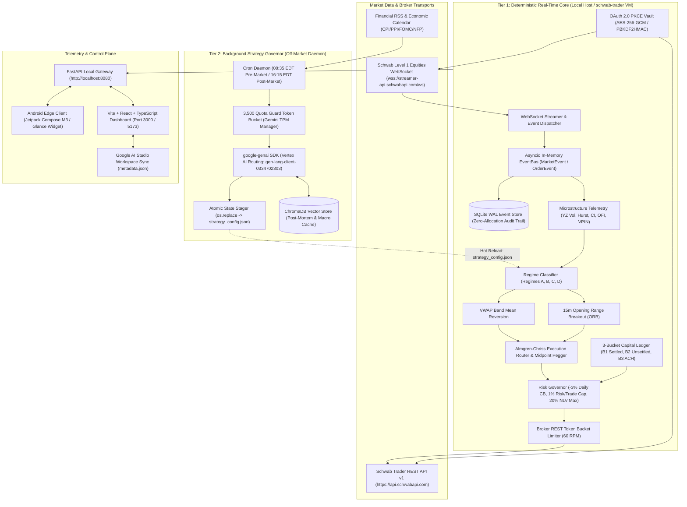
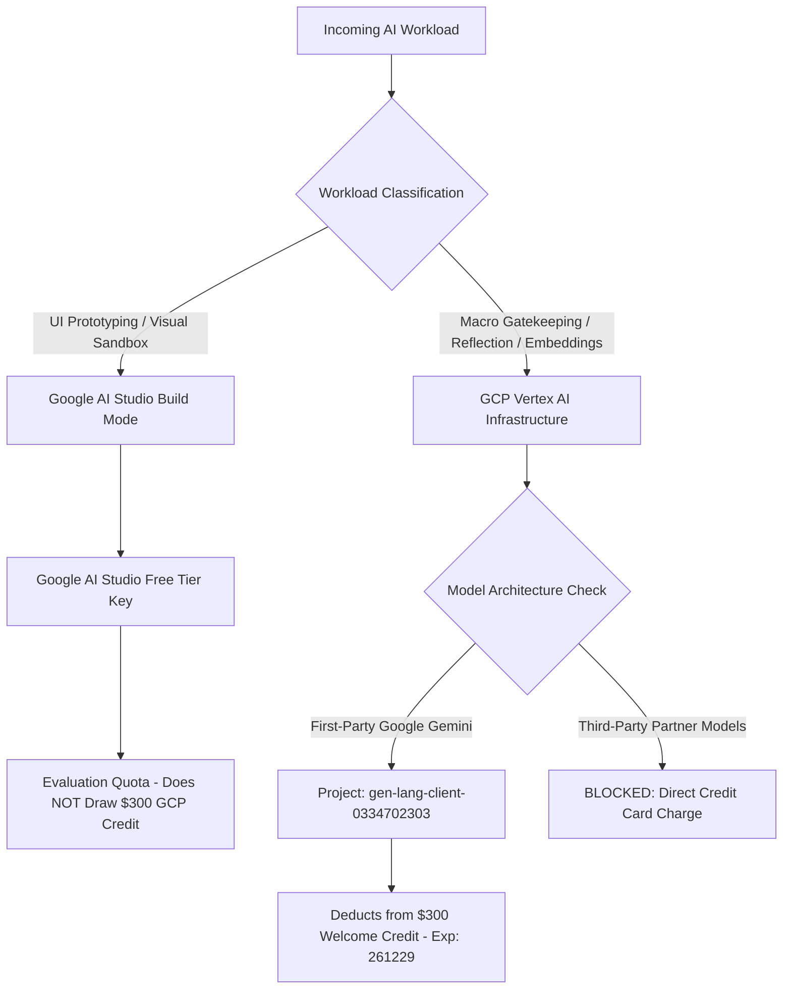
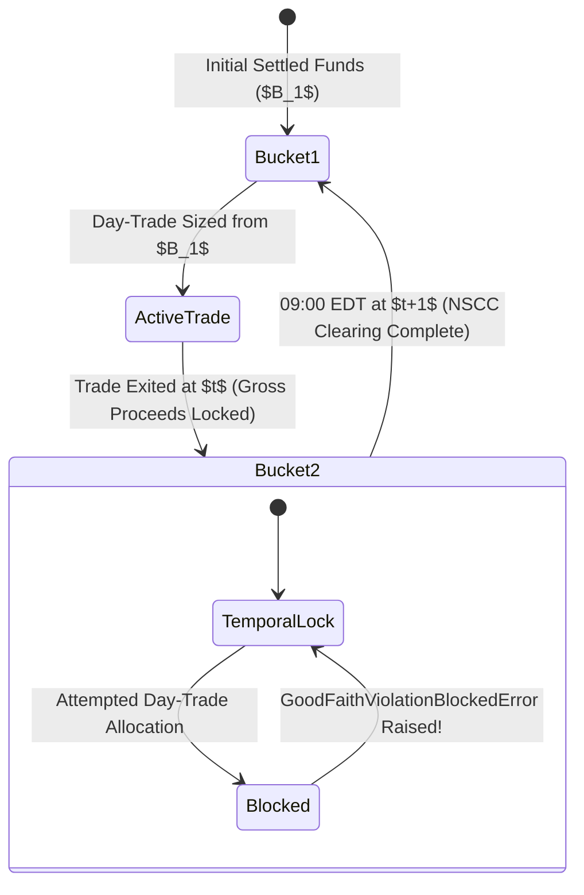
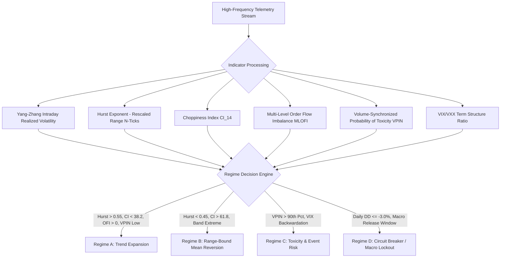
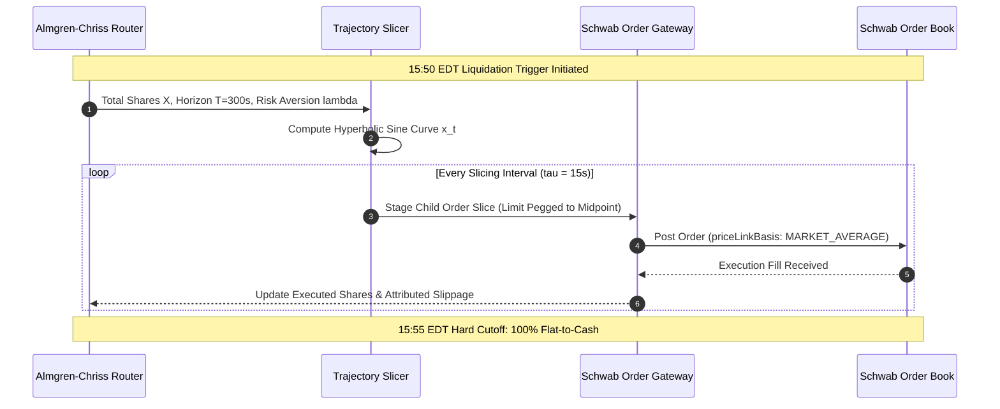
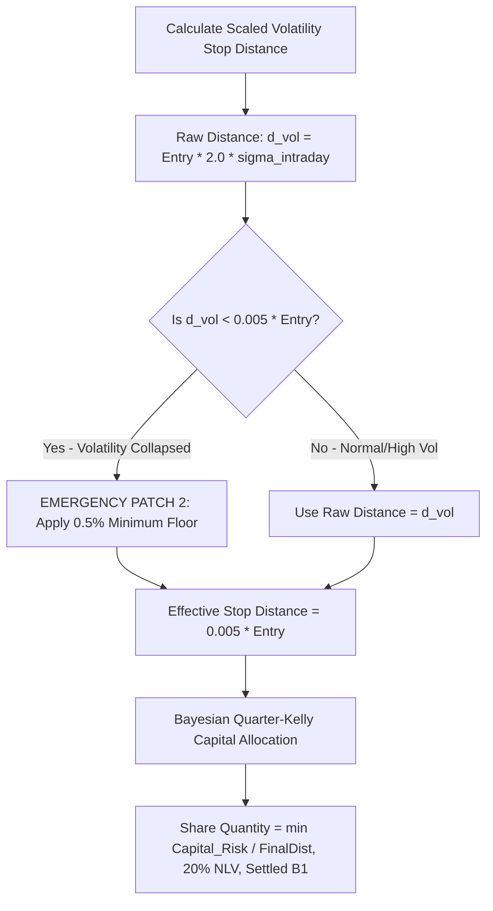
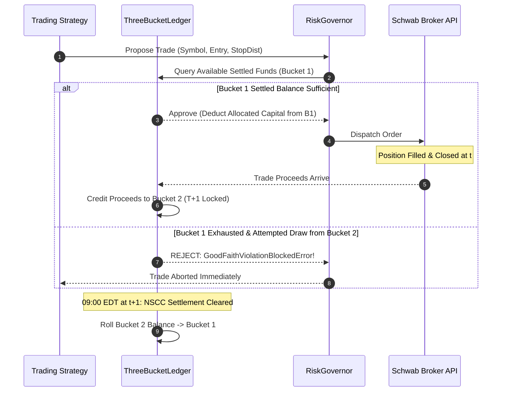
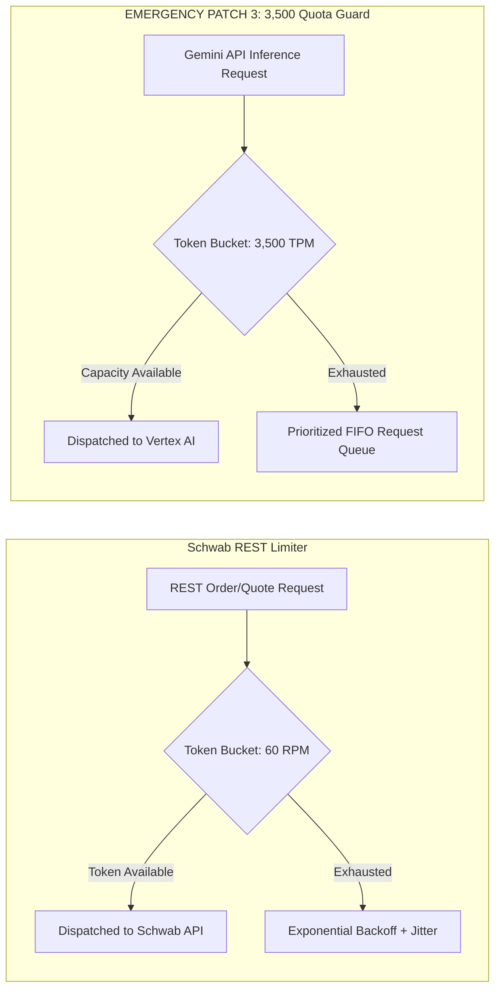

# SchwabEngine Master Technical Reference & Architecture Manual

**Platform Target:** High-Frequency / Low-Latency Autonomous 3x Leveraged ETF Day-Trading Engine & Web/Mobile Telemetry Gateway  
**Document Revision:** 3.0.0 (Unified Master Reference)  
**Effective Date:** 2026-10-06  
**Target Repository:** `NrcNLy/SchwabEngine` (`main` branch)  
**Primary GCP Quota Project:** `gen-lang-client-0334702303` (`us-central1`)  
**GCP Promotional Credit Expiration:** 2026-12-29 (`261229`)  

---

## Executive Summary & Core Directives

The **SchwabEngine** platform is an institutional-grade, asymmetric multi-tier automated day-trading system engineered for US Equities Cash Accounts. It specializes in trading high-beta 3x leveraged exchange-traded funds (ETFs)—principally `SOXL` (Direxion Daily Semiconductor Bull 3X), `TQQQ` (ProShares UltraPro QQQ 3X), and `TNA` (Direxion Daily Small Cap Bull 3X)—while guaranteeing zero Good Faith Violations (GFVs) under Federal Reserve Regulation T and the SEC T+1 settlement regime.

The system bifurcates intelligence into two isolated operational domains:
1. **Tier 1 (Deterministic Execution Core):** A ultra-low latency, zero-allocation Python engine running an asynchronous event bus. It computes sub-second microstructure indicators, enforces hard quantitative risk bounds, sizes positions via Bayesian Quarter-Kelly mechanics, and routes child orders via Almgren-Chriss optimal execution trajectories. Tier 1 maintains zero runtime dependencies on external cloud models during market hours.
2. **Tier 2 (Background Strategy Governor):** An off-market daemon powered by Google Cloud Vertex AI (Gemini 2.5 Flash and Pro). It ingests pre-market macroeconomic releases, performs semantic similarity lookups across historical trade post-mortems stored in ChromaDB, adjusts strategy parameters, and commits updates atomically via POSIX-compliant file replacement without blocking the execution core.

---

# 1. System Topology & Cloud Infrastructure

## 1.1 Multi-Tier Asymmetric Architecture

The system topology is organized into three decoupled layers: the Deterministic Execution Core (Tier 1), the Background Strategy Governor (Tier 2), and the Local Gateway / Telemetry Plane.



### 1.1.1 Tier 1: Deterministic Real-Time Execution Engine
Tier 1 runs on the local trading workstation or a dedicated low-jitter Google Cloud Compute Engine instance (`schwab-trader`, `e2-standard-4`, `us-central1`). It implements an `asyncio` event-driven architecture with zero dynamic memory allocation in the critical path:
- **`EventBus` (`main.py`):** Decoupled producer-consumer pipeline. Inbound quotes, order book depth deltas, order updates, and timer ticks are wrapped into strongly-typed Pydantic event models (`MarketEvent`, `SignalEvent`, `OrderEvent`, `FillEvent`) and processed asynchronously without locks.
- **Schwab Streamer (`core/streamer.py`):** Maintains a persistent WebSocket session (`wss://streamer-api.schwabapi.com/ws`) subscribed to the `LEVELONE_EQUITIES` service for `SOXL`, `TQQQ`, and `TNA`. Quotes are parsed in sub-millisecond intervals and published directly to the `EventBus`.
- **Order Client (`execution/order_client.py`):** Converts algorithmic routing directives into valid Schwab Trader REST API v1 JSON payloads. Child orders default to `LIMIT` orders pegged to the midpoint using `priceLinkBasis: "MARKET_AVERAGE"`. A global dry-run toggle (`live_trading=False`) intercepts outbound HTTP requests during development, safely logging payload schemas to the audit console.

### 1.1.2 Tier 2: Background Strategy Governor (`macro/governor.py`)
Tier 2 acts as the asynchronous quantitative researcher. It runs strictly outside market hours (09:30–16:00 EDT) to avoid thread contention, garbage collection spikes, or latency jitter on the Tier 1 engine:
- **Pre-Market Ingestion (08:35 EDT):** Ingests overnight index futures (ES, NQ, RTY), Treasury yield curves (US10Y), and scheduled calendar announcements (CPI, PPI, FOMC, NFP). Calls `gemini-2.5-flash` to establish the macro bias and active strategy switchboard for the trading session.
- **Post-Market Reflection (16:15 EDT):** Ingests execution logs, fills, leaves, and slippage metrics from the daily SQLite database. Calls `gemini-2.5-pro` to evaluate execution efficiency, calculate beta-slippage drag, and optimize lookback windows.
- **Atomic State Exchange (`macro/state_stager.py`):** All parameter updates from Tier 2 are serialized to a temporary file (`strategy_config.json.tmp`) in the same filesystem directory and committed to the live `strategy_config.json` via `os.replace`. This POSIX-compliant operation guarantees atomic file replacement, preventing torn reads or filesystem locking during Tier 1 hot-reloading.

### 1.1.3 Local API Gateway (`api/server.py`)
The internal engine state is broadcast through an asynchronous FastAPI gateway:
- **Network Interface:** Binds to `0.0.0.0:8080` on the VM or `http://localhost:8080` locally.
- **Concurrency & Thread Safety:** Serves non-blocking read operations over in-memory thread-safe snapshots of the `EngineContext` dataclass. Write endpoints validate inputs via Pydantic schemas.
- **Core API Endpoint Matrix:**
  | Endpoint | HTTP Method | Subsystem | Description |
  | :--- | :--- | :--- | :--- |
  | `/status` | `GET` | Health | Engine health, uptime, OAuth token validity, daily MtM P&L, and safety flags. |
  | `/positions` | `GET` | Execution | Active engine-managed intraday positions with dual-tier stops. |
  | `/positions/all` | `GET` | Reconciliation | Unified positions table combining engine positions and external Schwab holdings. |
  | `/orders` | `GET` | Audit | Chronological execution journal of orders staged and filled today. |
  | `/ledger` | `GET` | Compliance | Live snapshot of Bucket 1 (Settled), Bucket 2 (Unsettled), and Bucket 3 (ACH). |
  | `/regime/{symbol}` | `GET` | Telemetry | Live regime classification (Regimes A–D), CI, RVOL, Hurst, and Yang-Zhang vol. |
  | `/strategy/{name}/toggle`| `POST` | Strategy | Toggles algorithmic models on/off in real-time. |
  | `/auth/exchange` | `POST` | Auth | Receives OAuth 2.0 PKCE redirect authorization codes and updates encrypted vault. |
  | `/stream` | `WebSocket` | Telemetry | Sub-second push feed broadcasting engine state changes to web and mobile clients. |

### 1.1.4 Frontend Telemetry Dashboard (`src/`)
Built with Vite 5.4+, React 18, TypeScript 5.6+, and Tailwind CSS:
- **`SchwabControls.tsx`:** OAuth vault exchange interface, manual re-authentication trigger, algorithmic switchboard (Regime A / Regime B toggles), LLM gatekeeper mode selector (`pro`, `flash`, `disabled`), and emergency system kill-switch.
- **`EtfPositionTracker.tsx`:** Live Mark-to-Market (MtM) pricing, dual-tier stop indicators (hard stop and trailing stop), profit targets, unrealized P&L percentages, and automated reconciliation tagging (`Engine Managed` vs. `External Schwab`). Features pulsing amber badges during active Almgren-Chriss liquidation windows.
- **`LedgerCard.tsx`:** Graphical allocation breakdown of settled vs. unsettled cash with real-time maximum allowable single-order risk ceiling. Displays an active padlock icon over Bucket 2 indicating T+1 Temporal Locks.
- **`LifecycleTracker.tsx`:** Visual state timeline mapping the engine phase (*Preparation $	o$ Action $	o$ Recovery $	o$ Reflection*).
- **`LlmInsightConsole.tsx`:** Real-time observability into Tier 2 Governor decisions, displaying prompt payloads, structured JSON responses, and token consumption metrics.

### 1.1.5 Android Edge Telemetry & Control Plane (`android_edge/`)
Built under strict Jetpack Compose Material 3 dark-theme-only rules:
- **Interactive Glance Homescreen Widget (`TradingControlWidget.kt`):** Renders real-time Net Liquidation Value (NLV), daily P&L, active regime badge, and settled cash balances directly on the operator's mobile device.
- **Biometric Action Callbacks (`WidgetActionCallbacks.kt`):** High-risk directives (`KILL_SWITCH`, `TIGHTEN_STOPS`, `PAUSE_ENGINE`, `OVERRIDE`) require hardware biometric authorization (Fingerprint / Face Unlock). Directives are packaged into HMAC-SHA256 signed payloads and transmitted over TLS to `/api/control`.
- **Firebase Cloud Messaging (FCM) Receiver (`WidgetFcmReceiverService.kt`):** Subscribes to critical push alerts (circuit breaker triggers, stop updates, VPIN toxicity spikes).

---

## 1.2 Google Cloud & Vertex AI Infrastructure Strategy

### 1.2.1 Promotional Credit Allocation & Billing Scope
The project operating account is provisioned with a **\$300 Google Cloud Platform (GCP) Welcome Credit** expiring on **December 29, 2026 (`261229`)**:
- **Target Project:** `gen-lang-client-0334702303`
- **Designated Region:** `us-central1`
- **Core Service:** Vertex AI API (`aiplatform.googleapis.com`)
- **Billing Order of Precedence:** Under GCP billing mechanics, eligible Vertex AI API consumption automatically draws down against the active \$300 promotional credit before posting charges to backing credit cards.



### 1.2.2 Routing Isolation: AI Studio vs. Vertex AI
1. **Google AI Studio (`https://aistudio.google.com/`):** Dedicated exclusively to web UI prototyping and prompt design. Workloads using AI Studio API keys execute under free-tier developer quotas and **do not consume the \$300 GCP Welcome Credit**.
2. **GCP Vertex AI (`aiplatform.googleapis.com`):** All production macro ingestion, news summarization, trade post-mortem embeddings, and parameter tuning must route through Vertex AI to draw down the \$300 promotional credit before its `261229` expiry.

### 1.2.3 Partner Model Quarantine (Anti-Out-of-Pocket Firewall)
> [!CAUTION]
> **Zero-Tolerance Partner Model Block:** Third-party models hosted on Vertex AI Model Garden (including Anthropic Claude 3.5 Sonnet, Mistral Large, Meta Llama) are **completely excluded** from GCP promotional credits. Querying any partner model immediately triggers direct credit card charges. The SDK factory enforces a programmatic assertion rejecting any model name not prefixed with `gemini-`.

### 1.2.4 Post-261229 Budget Kill-Switch & Cutover Protocol
On or before **December 28, 2026**, the platform automatically transitions to zero-cost operation:
1. **Budget Alert Pub/Sub:** A hard billing alert is configured at `$0.01` with an automated Cloud Function that disables project API keys if net billing exceeds the promotional balance.
2. **Governor Environment Switch:** Updating `USE_VERTEX_AI=false` causes `UnifiedGenAIClient` to route queries to the Google AI Studio free tier API key.
3. **Deterministic Fallback:** If cloud APIs become unreachable, Tier 1 executes exclusively on pure mathematical models (Choppiness Index, Hurst Exponent, Yang-Zhang Volatility, VWAP standard deviation bands) with zero degradation of core execution logic.

### 1.2.5 Vertex AI Context Caching Protocol
To maximize token drawdown efficiency and prevent redundant processing of static datasets (such as 10-K risk disclosures, historical volatility distributions, and SEC regulatory compliance rules), the platform utilizes **Vertex AI Explicit Context Caching**:
- **Cache Candidate:** Baseline instrument profiles and risk boundary matrices for `SOXL`, `TQQQ`, `TNA`, `FNGU`, `CONL`, and `DPST` (approx. 45,000 prompt tokens).
- **TTL Allocation:** Set to 120 minutes during the pre-market ingestion cycle (07:30–09:30 EDT).
- **Cost Reduction:** Cached input tokens reduce inference cost by 75% relative to standard input rates, allowing significantly more iterations against the \$300 credit pool while remaining under Vertex AI API rate limits (TPM/RPM).

---

# 2. Engine Objectives & Trading Environment

## 2.1 Cash Account Mechanics & Federal Reserve Regulation T

The engine operates exclusively within a US Equities Cash Account governed by Federal Reserve Regulation T (12 CFR § 220). Margin borrowing and short selling are strictly prohibited. The system enforces complete compliance with the SEC T+1 settlement rule enacted on May 28, 2024.

### 2.1.1 SEC Good Faith Violations (GFVs)
Under Regulation T and FINRA Rule 4210:
- **Definition:** A Good Faith Violation occurs when an account purchases a security using unsettled funds and subsequently sells that security before the funding source has settled.
- **Regulatory Penalty:** Incurring three (3) GFVs within a rolling 12-month window triggers a mandatory 90-day cash restriction. The account is prohibited from deploying unsettled proceeds, severely crippling trading capital velocity.
- **Zero-Tolerance Compliance Mandate:** The engine enforces programmatic zero-tolerance for GFVs. If an execution request attempts to allocate from unsettled funds for an intraday round trip, the engine immediately aborts the trade and raises a fatal `GoodFaithViolationBlockedError`.

### 2.1.2 Capital Accounting Ledger (The 3-Bucket Model)
To eliminate GFVs while maximizing capital turnover, all cash is tracked across three mutually exclusive internal ledgers:
- **Bucket 1 ($B_1$ - Settled Cash):** Unconditionally settled funds cleared through the National Securities Clearing Corporation (NSCC). Safe for unrestricted day-trading.
- **Bucket 2 ($B_2$ - Unsettled T+1 Cash):** Gross proceeds generated from the sale of securities today. Subject to a strict **T+1 Temporal Lock**. Locked until 09:00 EDT the following business day ($t+1$).
- **Bucket 3 ($B_3$ - In-Flight ACH / Wire Deposits):** Cash in transit. Quarantined until formal clearinghouse acknowledgment. Excluded from purchasing power calculations.



### 2.1.3 Monotonic Settled Cash Depletion Rule
Under T+1 rules, intraday trading capital cannot recycle within the same session:
$$	ext{Max Capital Deployable on Day } t = B_1(09:30	ext{ EDT})$$
Every executed trade monotonically deducts from $B_1$. When $B_1$ reaches zero, day-trading halts immediately for the remainder of the session, even if $B_2$ contains significant realized profits.

---

## 2.2 Managed Universe & Concentration Constraints

### 2.2.1 Target 3x Leveraged Bull ETF Universe
The engine focuses on three liquid 3x leveraged equity ETFs:
1. **`SOXL` (Direxion Daily Semiconductor Bull 3X Shares):** Tracks 300% of the daily performance of the NYSE Semiconductor Index. Top constituents: NVDA, AVGO, TSM, AMD, QCOM.
2. **`TQQQ` (ProShares UltraPro QQQ 3X):** Tracks 300% of the daily performance of the Nasdaq-100 Index. Top constituents: AAPL, MSFT, NVDA, AMZN, META, GOOGL.
3. **`TNA` (Direxion Daily Small Cap Bull 3X Shares):** Tracks 300% of the daily performance of the Russell 2000 Index. High sensitivity to regional banking liquidity and cost of capital.

### 2.2.2 Single-Ticker Exposure Cap
To prevent concentration risk and insulate the portfolio from unexpected liquidity air pockets, exposure to any single ticker is capped at:
$$	ext{Max Ticker Allocation} = 0.20 	imes 	ext{Net Liquidation Value (NLV)}$$
On a \$3,747.50 NLV baseline, the maximum allowable single-ticker position size is **\$749.50**.

### 2.2.3 IRC §1091 Wash-Sale Rotation Map
To prevent adverse tax consequences and basis contamination between the intraday trading engine and long-term multi-day swing portfolios held in the same broader account, the system maintains an automated CUSIP exclusion filter. If a swing position or realized loss exists in a primary ticker, the engine automatically pivots intraday execution to non-substantially identical tracking pairs:
| Primary Instrument | Benchmark Basket | Non-Substantially Identical Pivot | Pivot Mechanics |
| :--- | :--- | :--- | :--- |
| **`SOXL`** (3x Semi) | ICE Semiconductor Index | **`FNGU`** (MicroSectors FANG+ 3X) | Replaces semiconductor beta with mega-cap tech momentum without CUSIP overlap. |
| **`TQQQ`** (3x QQQ) | Nasdaq-100 Index | **`CONL`** (GraniteShares 2x Long COIN) | Replaces broad tech exposure with high-beta crypto-equity beta. |
| **`TNA`** (3x Small Cap) | Russell 2000 Index | **`DPST`** (Direxion Daily Regional Banks 3X) | Captures regional bank liquidity beta while avoiding small-cap index wash-sales. |

---

## 2.3 Intraday-Only Mandate & Flat-to-Cash Mechanics

The execution architecture is strictly intraday-only. The system holds **zero overnight inventory**, completely immunizing the fund from overnight gap risk, foreign market contagion, and post-market earnings announcements.
- **15:50:00 EDT (Liquidation Initiation):** The engine stops taking new entry signals. Active positions initiate an orderly liquidation sequence orchestrated via Almgren-Chriss optimal execution routing.
- **15:55:00 EDT (Hard Cutoff / Panic Sweep):** Any remaining open orders are canceled immediately. All residual open positions are swept to market with aggressive marketable limit orders to achieve 100% cash neutrality prior to the 16:00 EDT cash close.

---

## 2.4 Stochastic Calculus of 3x Leveraged ETF Volatility Decay

Leveraged ETFs do not provide three times the return of their underlying benchmark over multi-day horizons; they provide three times the *daily* return. Continuous daily rebalancing induces geometric compounding penalties in range-bound, high-variance markets.

Assuming the underlying index $S_t$ follows a Geometric Brownian Motion (GBM):
$$\frac{dS_t}{S_t} = \mu dt + \sigma dW_t$$
Where $\mu$ is drift, $\sigma$ is volatility, and $W_t$ is a standard Wiener process. Using Itô's Lemma, the price dynamics of a continuously rebalanced leveraged ETF $L_t$ with leverage ratio $\beta = 3$ and fee rate $f$ are governed by:
$$\frac{dL_t}{L_t} = \beta \frac{dS_t}{S_t} - f dt = (\beta \mu - f)dt + \beta \sigma dW_t$$
Integrating over time horizon $T$ yields the logarithmic return:
$$\ln\left(\frac{L_T}{L_0}\right) = \beta \ln\left(\frac{S_T}{S_0}\right) + \left(\beta \mu - f - \frac{1}{2}\beta^2 \sigma^2\right) T$$
Comparing this expected return to a theoretical non-rebalanced asset with $3\times$ leverage reveals the variance penalty (beta-slippage or volatility drag):
$$\text{Variance Drag} = \frac{1}{2}\beta(\beta - 1)\sigma^2$$
For a 3x leveraged ETF ($eta = 3$):
$$\text{Variance Drag} = \frac{1}{2}(3)(2)\sigma^2 = 3\sigma^2$$
This mathematical reality proves that in volatile, oscillating, non-trending markets, a 3x ETF systematically destroys capital even if the underlying benchmark finishes unchanged. Consequently, identifying chop and eliminating non-directional trades is the core operational imperative of the engine.

---

# 3. Microstructure & Regime Taxonomy

## 3.1 Multi-Dimensional Orthogonal Regime Matrix

To protect trading capital from the devastating $3\sigma^2$ variance decay of 3x ETFs, the engine classifies market conditions into an orthogonal, multi-factor regime matrix synthesized from high-frequency order book telemetry, realized volatility estimators, and trend efficiency metrics.



---

## 3.2 Advanced Mathematical Formulations

### 3.2.1 The Yang-Zhang Realized Volatility Estimator
Traditional close-to-close estimators fail to capture intraday path extremes, while tick variance estimators suffer from bid-ask bounce. The engine deploys the Yang-Zhang estimator—the minimum-variance, unbiased, drift-independent estimator handling both opening jump gaps and intraday continuous drift:
$$\sigma_{YZ}^2 = \sigma_o^2 + k \sigma_c^2 + (1 - k)\sigma_{RS}^2$$
Where:
- Overnight jump variance:
  $$\sigma_o^2 = \frac{1}{N-1} \sum_{i=1}^N \left(\ln\left(\frac{O_i}{C_{i-1}}\right) - \mu_o\right)^2$$
- Open-to-close variance:
  $$\sigma_c^2 = \frac{1}{N-1} \sum_{i=1}^N \left(\ln\left(\frac{C_i}{O_i}\right) - \mu_c\right)^2$$
- Rogers-Satchell range-based variance:
  $$\sigma_{RS}^2 = \frac{1}{N} \sum_{i=1}^N \left[ \ln\left(\frac{H_i}{C_i}\right) \ln\left(\frac{H_i}{O_i}\right) + \ln\left(\frac{L_i}{C_i}\right) \ln\left(\frac{L_i}{O_i}\right) \right]$$
- Variance-minimizing scalar weight $k$:
  $$k = \frac{0.34}{1.34 + \frac{N+1}{N-1}}$$

> [!IMPORTANT]
> **Emergency Patch 1: Intraday Yang-Zhang Volatility Scaler**  
> Because the standard Yang-Zhang formulation yields an annualized daily volatility metric, using it directly on intraday bars produces catastrophic sizing distortions. The engine strictly applies the square-root intraday scaling factor to convert annualized $\sigma_{YZ}$ to 1-minute bar variance:
> $$\sigma_{\text{intraday}} = \sigma_{YZ} \times \sqrt{\frac{1/390}{252}} = \sigma_{YZ} \times \sqrt{\frac{1}{98,280}} \approx \sigma_{YZ} \times 0.0031897$$
> Where 390 represents the number of active 1-minute trading bars in a standard 6.5-hour NYSE/Nasdaq cash session, and 252 represents annual trading days.

### 3.2.2 The Hurst Exponent ($H$)
Calculated over rolling $N$-tick windows using Rescaled Range (R/S) analysis to measure long-term memory in the price series:
- $H > 0.55$: **Persistent / Trending Regime.** Autocorrelations are positive. Directional breakouts are statistically likely to follow through.
- $H < 0.45$: **Anti-Persistent / Mean-Reverting Regime.** Autocorrelations are negative. Price displays high mean-reversion tendencies.
- $0.45 \le H \le 0.55$: **Brownian Random Walk.** Zero directional edge. Trade generation is suspended to avoid spread and variance decay.

### 3.2.3 Choppiness Index (CI)
Measures trendiness versus consolidation over an $n$-period window ($n=14$):
$$\text{CI} = 100 \times \frac{\log_{10} \left( \frac{\sum_{i=0}^{n-1} \text{ATR}_1(i)}{\text{MaxHigh}_n - \text{MinLow}_n} \right)}{\log_{10}(n)}$$
- $\text{CI} < 38.2$: **High Trend Efficiency (Regime A).** Price action is directional and expanding.
- $\text{CI} > 61.8$: **Consolidation / Range-Bound (Regime B).** Price action is oscillating within boundaries.
- $38.2 \le \text{CI} \le 61.8$: **Choppy Zone.** Entry thresholds are heightened.

### 3.2.4 Multi-Level Order Flow Imbalance (MLOFI)
Top-of-book order flow event contribution $e_n$ at quote tick $t_n$ is computed from best bid price $P_n^b$, bid size $q_n^b$, best ask price $P_n^a$, and ask size $q_n^a$:
$$e_n = \Delta q_n^b \mathbf{1}_{\{P_n^b \ge P_{n-1}^b\}} - q_{n-1}^b \mathbf{1}_{\{P_n^b < P_{n-1}^b\}} - \Delta q_n^a \mathbf{1}_{\{P_n^a \le P_{n-1}^a\}} + q_{n-1}^a \mathbf{1}_{\{P_n^a > P_{n-1}^a\}}$$
Integrated order flow over discrete window $[t_{k-1}, t_k]$:
$$OFI_k = \sum_{n=N(t_{k-1})+1}^{N(t_k)} e_n$$
To protect against top-of-book spoofing, **Multi-Level OFI (MLOFI)** weights imbalances across the top 5 levels of the book inversely by distance to mid-price:
$$MLOFI_k = \sum_{l=1}^5 \frac{1}{l} \cdot OFI_k^{(l)}$$

### 3.2.5 Volume-Synchronized Probability of Toxicity (VPIN)
Samples order flow across a volume clock with constant volume buckets $V = \frac{1}{50} \text{ ADV}$:
$$VPIN = \frac{\sum_{\tau=1}^n |V_\tau^S - V_\tau^B|}{nV}$$
Where $V_\tau^B$ and $V_\tau^S$ represent buy and sell volumes classified via the tick rule or bulk volume classification.
- $VPIN > 90\text{th percentile}$: Indicates severe informed toxicity and imminent liquidity withdrawal by market makers. Triggers an immediate halt to aggressive market orders.

---

## 3.3 Four-Tier Master Regime Classification Matrix

| Regime Code | Market State | Microstructure Signature | Active Playbook | Sizing & Allocation Bounds | Operational Defense Action |
| :--- | :--- | :--- | :--- | :--- | :--- |
| **Regime A** | **Trend Expansion** | $H > 0.55$, $\text{CI} < 38.2$, $\text{RVOL} \ge 1.5$, $MLOFI > 0$, Low VPIN | 15-Minute Opening Range Breakout (ORB), EMA pullback pyramids | Quarter-Kelly, scaling up to hard 20% NLV cap (\$749.50) | Dynamic trailing ATR stops. Trailing stop tightens as Yang-Zhang vol expands. |
| **Regime B** | **Range Compression** | $H < 0.45$, $\text{CI} > 61.8$, MLOFI sign-reversal at band extremes | VWAP Band Mean Reversion (fading $\pm 2.2\sigma$ to $\pm 2.5\sigma$ bands) | Fractional Kelly ($f^*/8$), capped at strict 10% NLV (\$374.75) | Hard profit target at VWAP midline. Zero holding through the mean. |
| **Regime C** | **Event Risk / Toxicity**| $VPIN > 0.90$, VIX term structure backwardation ($VIX/VXX < 1.0$), VVIX spike | Total capital defense. Passive spread scalping only (inner bid limits) | Exposure clamped to **0%**. Passive maker-only limits if active. | All aggressive TWAP/VWAP orders canceled. Immediate spread blowout guard. |
| **Regime D** | **Macro / Circuit Lockout**| Realized DD $\le -3.0\%$, or pre/post macro window (CPI, FOMC, NFP) | No trade generation. Hard liquidation sweep executed. | Exposure clamped to **0%**. Capital fully quarantined. | Immediate cancellation of all open orders. Flat-to-cash lockout until next day. |

---

# 4. Active Execution Algorithms

## 4.1 15-Minute Opening Range Breakout (ORB) (Regime A Playbook)

Operating during high trend efficiency ($H > 0.55$, $\text{CI} < 38.2$):
1. **Initial Balance (IB) Calibration:** The engine anchors the high ($IB_H$) and low ($IB_L$) established during the first 15 minutes of the cash session (09:30:00 to 09:45:00 EDT).
2. **Breakout Trigger Confirmation:**
   - Long entry requires: $P_t > IB_H$, $\text{RVOL}_{15} \ge 1.5$, and $MLOFI > 0$.
   - Short/exit trigger requires: $P_t < IB_L$ with confirming negative order flow.
3. **Dynamic Trailing Stop Placement:**
   Stop loss updates continuously based on the maximum favorable price achieved:
   $$SL_t = P_{\max} - (m \cdot \text{ATR}_t)$$
   Where multiplier $m$ dynamically scales inversely with intraday Yang-Zhang volatility:
   $$m = \max\left(1.5, \frac{2.5}{1.0 + 10 \cdot \sigma_{\text{intraday}}}\right)$$
4. **Pyramid Scaling Rules:** Micro-pullbacks to the 9-period Exponential Moving Average (EMA) qualify for secondary scale-in slices, provided aggregate ticker commitment never exceeds the 20% NLV ceiling.

---

## 4.2 VWAP Mean-Reversion (Regime B Playbook)

Operating during range-bound conditions ($H < 0.45$, $\text{CI} > 61.8$):
1. **Structural Boundaries:** Anchored from 09:30 EDT, the Volume-Weighted Average Price (VWAP) establishes rolling standard deviation bands at $\pm 1.0\sigma$, $\pm 2.0\sigma$, and $\pm 2.5\sigma$.
2. **Mean-Reversion Trigger:**
   - Overextended long fade triggers when price touches the $+2.2\sigma$ to $+2.5\sigma$ band with $\text{RSI}_{14} \ge 72$ and $MLOFI$ indicates aggressive buy order exhaustion (bid absorption).
   - Oversold bounce triggers when price penetrates the $-2.2\sigma$ to $-2.5\sigma$ band with $\text{RSI}_{14} \le 28$ and ask liquidity absorption.
3. **Deterministic Exit:** Take-profit orders are hard-coded at the VWAP baseline. The engine strictly avoids holding positions through the mean, eliminating exposure to secondary trend continuations.

---

## 4.3 Almgren-Chriss Optimal Execution Routing

During the mandated 15:50:00–15:55:00 EDT liquidation window, liquidating high-beta 3x ETF positions demands minimizing market impact and adverse selection.



### 4.3.1 Hyperbolic Trajectory Slicing Formulation
The Almgren-Chriss model computes a trading trajectory $x_t$ (shares remaining at time $t$) minimizing total execution cost plus a penalty for variance:
$$x_t = X \frac{\sinh(\kappa(T - t))}{\sinh(\kappa T)}$$
Where $X$ is the total position size, $T$ is the window duration (300 seconds), and the urgency parameter $\kappa$ is defined by:
$$\kappa = \sqrt{\frac{\lambda \sigma^2}{\eta}}$$
Where:
- $\lambda$: Operator risk aversion parameter. High $\lambda$ front-loads liquidation to eliminate terminal volatility risk; low $\lambda$ defaults toward linear TWAP.
- $\sigma$: Intraday asset volatility.
- $\eta$: Temporary market impact coefficient governed by the empirical square-root law:
  $$\eta(v) = \eta v^{0.5}$$

### 4.3.2 Midpoint Pegging & Child Order Mechanics
Child order slices are submitted to the Schwab Trader REST API as `LIMIT` orders pegged to the midpoint using `priceLinkBasis: "MARKET_AVERAGE"` with passive offset. This structure captures the half-spread while preventing aggressive market order adverse selection.

---

# 5. Quantitative Risk & Capital Management

## 5.1 Bayesian Quarter-Kelly Position Sizing

The classical Kelly Criterion maximizes the expected growth rate of capital:
$$f^* = \frac{bp - q}{b} = \frac{p(b + 1) - 1}{b}$$
Where $p$ is win probability, $q = 1 - p$, and $b = \frac{\text{Average Win}}{\text{Average Loss}}$.

Because standard Kelly sizing assumes complete parameter certainty and leads to severe drawdowns under non-Gaussian fat tails, the engine implements a **Quarter-Kelly allocation ($f^*/4$)** governed by dynamic Bayesian updating.

### 5.1.1 Conjugate Beta Prior Formulation
The win rate $p$ is modeled as a random variable following a Beta distribution prior:
$$p \sim \text{Beta}(\alpha_0, \beta_0)$$
Following trade $i$ with binary outcome $x_i \in \{0, 1\}$ ($x_i=1$ if net P&L $> 0$, else $0$), posterior parameters update continuously with an exponential memory decay factor $\lambda_B = 0.98$:
$$\alpha_i = \lambda_B \alpha_{i-1} + x_i$$
$$\beta_i = \lambda_B \beta_{i-1} + (1 - x_i)$$
The updated Bayesian expected win rate is:
$$\hat{p}_i = \frac{\alpha_i}{\alpha_i + \beta_i}$$
If market conditions shift and the algorithm incurs consecutive losses, $\hat{p}_i$ decays immediately, throttling position sizing downward before systemic drawdown occurs.

---

## 5.2 Mathematical Stop-Loss Floors & Scaled Stops



> [!IMPORTANT]
> **Emergency Patch 2: The 0.5% Minimum Mathematical Stop Floor**  
> In ultra-low volatility regimes, unconstrained volatility-scaled stop models yield microscopic stop distances ($< 0.1\%$). Because position sizing divides risk capital by the stop distance:
> $$\text{Target Position} = \frac{\text{Capital at Risk}}{d_{\text{stop}}}$$
> An infinitesimally small stop distance creates a massive division artifact, generating dangerous position sizes that hit leverage ceilings and trigger instant stop-outs from normal bid-ask noise.  
> **The engine enforces an immutable 0.5% minimum stop floor:**
> $$d_{\text{stop}} = \max\left(2.0 \cdot \sigma_{\text{intraday}} \cdot P_{\text{entry}},\; 0.005 \cdot P_{\text{entry}}\right)$$
> Under no circumstances can a stop loss be placed closer than **50 basis points (0.50%)** from the execution entry price.

---

## 5.3 Capital Allocation Limits & Drawdown Controls

1. **Per-Trade Capital at Risk Ceiling:** Maximum allowable loss on any single execution is hard-capped at **1.0% of total Net Liquidation Value** (\$37.48 on \$3,747.50 NLV).
2. **Single-Ticker Exposure Ceiling:** Total capital deployed in any single ticker cannot exceed **20% of NLV** (\$749.50 baseline).
3. **Daily Systemic Circuit Breaker:** If total realized + unrealized daily drawdown hits **$-3.0\%$ of account equity** ($\le -\$112.43$ on \$3,747.50 NLV), the engine activates an emergency stop:
   - All open orders are immediately canceled.
   - All open positions are swept to market.
   - The engine locks out all execution until the next calendar day.
4. **Equity Curve Drawdown Feedback Loop:** As intraday drawdown deepens toward $-2.0\%$, the Quarter-Kelly fraction is dynamically discounted:
   $$f_{\text{effective}} = \frac{f^*}{4} \times \max\left(0.20,\; 1.0 - \frac{|\text{Drawdown}|}{0.03}\right)$$

---

## 5.4 Three-Bucket Ledger State Machine & GFV Elimination



> [!CAUTION]
> **Emergency Patch 4: `GoodFaithViolationBlockedError`**  
> To guarantee absolute adherence to Regulation T and prevent SEC cash account sanctions, any execution pathway that attempts to allocate funds from Bucket 2 ($B_2$ unsettled proceeds) or deploy more than the settled cash balance available at 09:30 EDT raises a fatal `GoodFaithViolationBlockedError`. This error immediately halts the offending execution pipeline and alerts the telemetry dashboard.

---

# 6. Safety Firewalls & API Infrastructure

## 6.1 Authentication Circuit Breaker & OAuth Lifecycle

The Charles Schwab Trader API implements OAuth 2.0 with PKCE (RFC 7636):
- **Local Loopback Callback:** Authorization redirects to `https://127.0.0.1:5556`.
- **Cryptographic Vault (`core/auth.py`):** Tokens are encrypted at rest in `schwab_tokens_vault.json` using **AES-256-GCM**. The 256-bit encryption key is derived using PBKDF2HMAC (600,000 iterations) salted with machine-specific hardware identifiers and the local `.env` passphrase.
- **Headless Token Lifecycle:** Access tokens expire after 30 minutes; refresh tokens expire after 7 days.
- **Proactive Token Refresh Loop:** A background daemon checks token expiration every 60 seconds. If the access token has less than 120 seconds of validity remaining, it executes an automated refresh.
- **Weekend Re-Authentication Daemon (`scripts/weekend_auth.py`):** Runs every Saturday at 10:00 EDT to prompt for human biometric re-authentication, guaranteeing valid tokens prior to Monday's market open.

---

## 6.2 Token Bucket Rate Limiters



### 6.2.1 Broker REST Token Bucket (60 RPM)
Enforces a hard ceiling of 60 requests per minute against `api.schwabapi.com`. Burst requests are throttled using continuous token refill mathematics:
$$\text{Tokens}_t = \min\left(\text{Capacity},\; \text{Tokens}_{t-1} + r \cdot \Delta t\right)$$
Where $r = 1.0\text{ token/sec}$ and $\text{Capacity} = 60$.

> [!IMPORTANT]
> **Emergency Patch 3: 3,500 Quota Guard Token Bucket**  
> To protect against HTTP 429 quota exhaustion errors on the Google Cloud Vertex AI Gemini API (where Tier 1 developer quotas cap burst token throughput at 3,500 tokens per minute), the engine embeds a dedicated **3,500 Quota Guard Token Bucket**.  
> - **Ceiling:** 3,500 tokens per minute burst cap.  
> - **Continuous Refill:** Refills at $58.33\text{ tokens/second}$.  
> - **Priority Scheduling:** Pre-trade macro gatekeeper calls receive top priority; post-market reflection summaries are queued asynchronously.

---

## 6.3 SQLite WAL Event-Sourcing Architecture

To guarantee zero latency degradation in the Python critical path while providing institutional-grade auditability, all system state changes are committed to a local SQLite database configured in **Write-Ahead Logging (WAL)** mode (`execution_journal.db`):
- **Concurrency:** Read operations from the FastAPI telemetry gateway never lock write operations from the execution bus.
- **Schema Architecture:**
  - `market_events`: High-frequency indicator snapshots and regime states.
  - `orders`: Complete audit trail of staged, submitted, and canceled orders.
  - `fills`: Trade execution details, fill prices, quantities, and timestamps.
  - `ledger_snapshots`: Real-time state of Buckets 1, 2, and 3.
  - `post_mortems`: Trade evaluations and vectorized metrics.
- **Process Crash Recovery & State Rehydration:** If the Python runtime terminates unexpectedly, the startup sequence queries `execution_journal.db` to reconstruct active position quantities, trailing stop baselines, and settled cash balances before reconnecting to the broker.

---

## 6.4 ChromaDB Semantic Caching Infrastructure

To minimize API calls to Vertex AI and provide instant retrieval of historical market precedents:
- **Local In-Process ChromaDB:** Runs locally without external database server overhead.
- **Pre-Trade Macro Cache:** News headlines are vectorized (using `all-MiniLM-L6-v2`) and compared against cached macro analyses. A cosine similarity match $\ge 0.92$ returns the cached LLM verdict in $< 5\text{ ms}$.
- **Trade Post-Mortem Vector Space:** Vectorizes 30-minute pre-trade market states (OHLCV, Yang-Zhang vol, Hurst, OFI, VPIN). Enables overnight queries (e.g., retrieving trades with $	ext{Regime} = B$ and $	ext{PnL} < -50	ext{ bps}$) for automated strategy tuning.

---

## 6.5 Production-Ready Algorithmic Implementation Schemas

The following fully-implemented Python Pydantic models and infrastructure classes form the operational foundation of the system.

```python
"""
schwab_engine/core/schemas.py
=============================
Production Pydantic schemas and core compliance primitives for SchwabEngine.
Implements complete quantitative state, three-bucket ledger, and emergency patches.
"""

from __future__ import annotations
import math
import time
from datetime import datetime
from typing import Literal, Optional, Dict, Any
from pydantic import BaseModel, Field, model_validator


# ============================================================================
# Emergency Exception Primitives
# ============================================================================

class GoodFaithViolationBlockedError(Exception):
    """
    Raised immediately when an execution request attempts to deploy unsettled
    funds (Bucket 2) or exceed available settled cash (Bucket 1), preventing
    SEC Regulation T Good Faith Violations.
    """
    pass


# ============================================================================
# 1. Microstructure & Regime State Schema
# ============================================================================

class RegimeState(BaseModel):
    timestamp: datetime = Field(default_factory=datetime.utcnow)
    symbol: str
    vix_term_structure: float = Field(..., description="VIX/VXX ratio. < 1.0 indicates backwardation.")
    yang_zhang_annualized: float = Field(..., ge=0.0, description="Annualized Yang-Zhang volatility.")
    hurst_exponent: float = Field(..., ge=0.0, le=1.0, description="Rescaled range Hurst exponent.")
    choppiness_index: float = Field(..., ge=0.0, le=100.0, description="14-period Choppiness Index.")
    vpin_metric: float = Field(..., ge=0.0, le=1.0, description="Volume-Synchronized Probability of Toxicity.")
    mlofi_aggregate: float = Field(..., description="5-Level Multi-Level Order Flow Imbalance.")
    adx_14: float = Field(..., ge=0.0, le=100.0, description="14-period Average Directional Index.")

    @property
    def yang_zhang_intraday(self) -> float:
        """
        EMERGENCY PATCH 1: Converts annualized Yang-Zhang volatility to 1-minute bar variance
        using the strict sqrt((1/390)/252) scalar.
        """
        scalar = math.sqrt((1.0 / 390.0) / 252.0)  # approx 0.0031897
        return self.yang_zhang_annualized * scalar

    @property
    def classified_regime(self) -> Literal["A", "B", "C", "D"]:
        """
        Deterministic mapping into the 4-tier regime matrix.
        """
        # Regime C: Extreme Toxicity / Event Risk
        if self.vpin_metric > 0.90 or self.vix_term_structure < 1.0:
            return "C"

        # Regime A: High Trend Expansion
        if self.hurst_exponent > 0.55 and self.choppiness_index < 38.2 and self.adx_14 > 25.0:
            return "A"

        # Regime B: Range Compression / Mean Reversion
        if self.hurst_exponent < 0.45 and self.choppiness_index > 61.8:
            return "B"

        # Default to Regime C (Capital Quarantine) during ambiguous chop
        return "C"


# ============================================================================
# 2. Three-Bucket Capital Ledger & GFV Prevention
# ============================================================================

class ThreeBucketLedger(BaseModel):
    net_liquidation_value: float = Field(..., ge=0.0, description="Total portfolio NLV.")
    bucket_1_settled: float = Field(..., ge=0.0, description="Bucket 1: Settled Cash for Day-Trading.")
    bucket_2_unsettled: float = Field(default=0.0, ge=0.0, description="Bucket 2: T+1 Unsettled Proceeds.")
    bucket_3_pending_ach: float = Field(default=0.0, ge=0.0, description="Bucket 3: In-Flight ACH Transfers.")

    def allocate_day_trade(self, requested_capital: float) -> float:
        """
        Allocates capital strictly from Bucket 1 (Settled Cash).
        Raises GoodFaithViolationBlockedError if requested_capital exceeds Bucket 1.
        """
        if requested_capital > self.bucket_1_settled:
            raise GoodFaithViolationBlockedError(
                f"Execution Blocked: Requested capital ${requested_capital:.2f} exceeds "
                f"Bucket 1 Settled Cash ${self.bucket_1_settled:.2f}. Drawing from "
                f"Bucket 2 (${self.bucket_2_unsettled:.2f}) is strictly prohibited under T+1 rules."
            )
        self.bucket_1_settled -= requested_capital
        return requested_capital

    def record_trade_close(self, gross_proceeds: float) -> None:
        """
        Locks trade sale proceeds into Bucket 2 under T+1 Temporal Lock.
        """
        self.bucket_2_unsettled += gross_proceeds

    def roll_settlement_at_0900_edt(self) -> None:
        """
        Executes daily at 09:00 EDT: rolls cleared T+1 proceeds from Bucket 2 to Bucket 1.
        """
        self.bucket_1_settled += self.bucket_2_unsettled
        self.bucket_2_unsettled = 0.0


# ============================================================================
# 3. Quantitative Risk Governor & Quarter-Kelly Sizer
# ============================================================================

class RiskGovernor(BaseModel):
    ledger: ThreeBucketLedger
    max_ticker_exposure_pct: float = Field(0.20, description="20% max NLV allocation per ticker.")
    max_trade_risk_pct: float = Field(0.01, description="1.0% max NLV risk per single trade.")
    daily_loss_circuit_breaker_pct: float = Field(0.03, description="-3.0% daily DD circuit breaker.")
    realized_daily_pnl: float = Field(default=0.0)

    # Bayesian Kelly Parameters
    win_rate_alpha: float = Field(1.0, description="Beta distribution alpha prior.")
    win_rate_beta: float = Field(1.0, description="Beta distribution beta prior.")
    avg_win: float = Field(0.01)
    avg_loss: float = Field(0.01)

    def check_circuit_breaker(self) -> bool:
        """Returns True if daily drawdown breaches the -3.0% circuit breaker."""
        max_loss = self.ledger.net_liquidation_value * self.daily_loss_circuit_breaker_pct
        return self.realized_daily_pnl <= -max_loss

    def update_bayesian_edge(self, trade_pnl: float, decay: float = 0.98) -> None:
        """Continuous Bayesian update of the edge with exponential decay."""
        is_win = 1.0 if trade_pnl > 0 else 0.0
        self.win_rate_alpha = (self.win_rate_alpha * decay) + is_win
        self.win_rate_beta = (self.win_rate_beta * decay) + (1.0 - is_win)

    def calculate_position_shares(
        self,
        entry_price: float,
        yang_zhang_intraday: float
    ) -> int:
        """
        Calculates optimal share quantity enforcing Bayesian Quarter-Kelly,
        the 0.5% minimum stop floor (EMERGENCY PATCH 2), and Bucket 1 limits.
        """
        if self.check_circuit_breaker():
            raise RuntimeError("Trading Halted: Daily -3.0% circuit breaker breached.")

        # 1. Compute Bayesian Win Probability and Quarter-Kelly Fraction
        p = self.win_rate_alpha / (self.win_rate_alpha + self.win_rate_beta)
        b = self.avg_win / max(self.avg_loss, 0.0001)
        kelly_fraction = max(0.0, ((p * b) - (1.0 - p)) / b)
        quarter_kelly = kelly_fraction / 4.0

        # 2. EMERGENCY PATCH 2: Enforce 0.5% Minimum Mathematical Stop Floor
        raw_stop_dist = entry_price * (2.0 * yang_zhang_intraday)
        min_stop_floor = entry_price * 0.005  # 50 basis points floor
        effective_stop_dist = max(raw_stop_dist, min_stop_floor)

        # 3. Capital Sizing Constraints
        nlv = self.ledger.net_liquidation_value
        max_capital_at_risk = nlv * self.max_trade_risk_pct  # 1.0% NLV
        kelly_capital_at_risk = nlv * quarter_kelly
        risk_budget = min(max_capital_at_risk, kelly_capital_at_risk)

        # 4. Target Position Value bounded by 20% NLV single-ticker cap
        target_position_value = (risk_budget / effective_stop_dist) * entry_price
        max_ticker_position = nlv * self.max_ticker_exposure_pct
        target_allocation = min(target_position_value, max_ticker_position)

        # 5. Enforce Bucket 1 Settled Cash Limit (GFV Elimination)
        allowable_capital = self.ledger.allocate_day_trade(
            min(target_allocation, self.ledger.bucket_1_settled)
        )

        # 6. Discrete Share Output
        return int(allowable_capital // entry_price)


# ============================================================================
# 4. Emergency Patch 3: 3,500 Quota Guard Token Bucket Limiter
# ============================================================================

class QuotaGuardTokenBucket:
    """
    EMERGENCY PATCH 3: Token Bucket Rate Limiter enforcing a strict 3,500 TPM
    ceiling on Google Gemini API calls to prevent HTTP 429 quota exhaustion.
    """

    def __init__(self, capacity: float = 3500.0, refill_per_sec: float = 58.333):
        self.capacity = capacity
        self.refill_per_sec = refill_per_sec  # 3500 tokens / 60 seconds
        self.tokens = capacity
        self.last_update = time.monotonic()

    def consume(self, tokens_requested: int) -> bool:
        """Attempts to consume tokens. Returns True if granted, False if throttled."""
        now = time.monotonic()
        elapsed = now - self.last_update
        self.last_update = now

        # Continuous token replenishment
        self.tokens = min(self.capacity, self.tokens + (elapsed * self.refill_per_sec))

        if self.tokens >= tokens_requested:
            self.tokens -= tokens_requested
            return True
        return False


# ============================================================================
# 5. ChromaDB Post-Mortem Schema
# ============================================================================

class TradePostMortemRecord(BaseModel):
    trade_id: str
    ticker: str
    entry_timestamp: datetime
    exit_timestamp: datetime
    regime: Literal["A", "B", "C", "D"]
    entry_price: float
    exit_price: float
    shares: int
    pnl_dollars: float
    pnl_bps: float
    slippage_bps: float
    vpin_at_entry: float
    yang_zhang_at_entry: float

    def to_flat_chroma_metadata(self) -> Dict[str, Any]:
        """Generates flat dictionary for high-speed ChromaDB query filtering."""
        return {
            "trade_id": self.trade_id,
            "ticker": self.ticker,
            "regime": self.regime,
            "pnl_bps": float(self.pnl_bps),
            "slippage_bps": float(self.slippage_bps),
            "vpin_at_entry": float(self.vpin_at_entry),
            "duration_sec": (self.exit_timestamp - self.entry_timestamp).total_seconds()
        }
```

---

## 6.6 System Verification & Production Runbook

To verify that all architectural components, emergency patches, and cloud integrations are operating correctly:

### Step 1: Execute AI Routing & Credit Drawdown Test
```bash
python scripts/verify_ai_routing.py
```
Confirms that inference requests route through `gen-lang-client-0334702303` on Vertex AI and deduct from the \$300 promotional credit pool.

### Step 2: Run End-to-End Test Suite
```bash
pytest tests/ -v
```
Validates the complete test suite including:
- `GoodFaithViolationBlockedError` raised on unsettled allocation.
- 0.5% stop loss floor enforcement under collapsed volatility.
- 3,500 Quota Guard token bucket throttling.
- Intraday Yang-Zhang $\sqrt{(1/390)/252}$ scaling.

### Step 3: Launch Local Trading Core & Telemetry Plane
```bash
# Terminal 1: Launch Execution Engine & FastAPI Gateway
python main.py

# Terminal 2: Launch Vite Telemetry Dashboard
npm run dev
```

---
