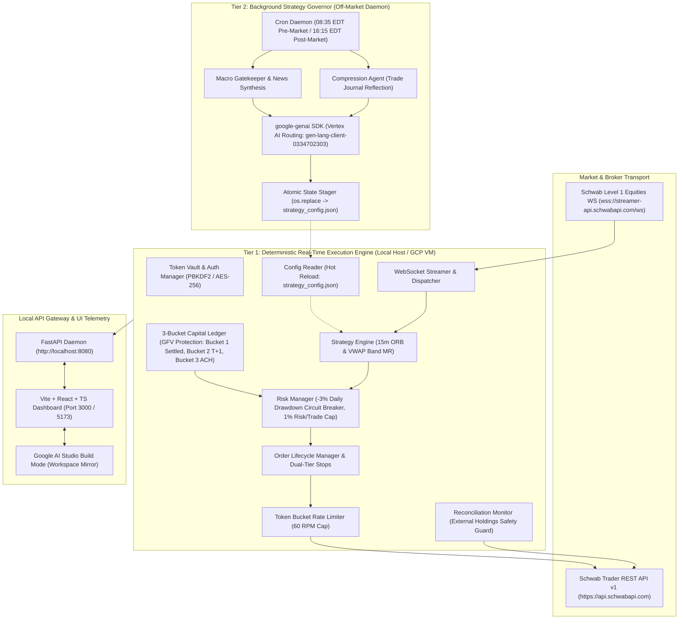
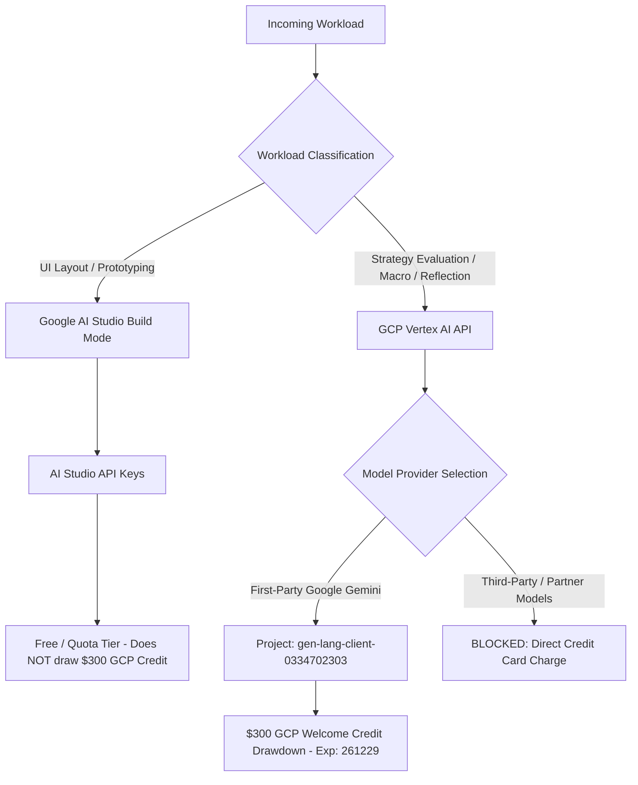
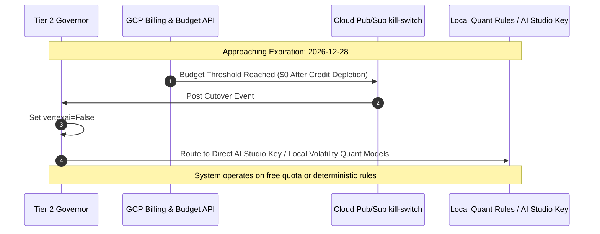

# SchwabEngine: Comprehensive Technical Architecture & Cloud Reference Manual

**Platform Target:** High-Frequency/Low-Latency Autonomous ETF Day-Trading Engine & Web Telemetry Gateway  
**Document Revision:** 2.1.0  
**Effective Date:** 2026-10-02  
**Target Repository:** `NrcNLy/SchwabEngine` (`main` branch)  
**Primary GCP Project:** `gen-lang-client-0334702303`  
**GCP Credit Allocation Expiration:** 2026-12-29 (`261229`)

---

## Table of Contents
1. [Executive System Architecture & Topology](#1-executive-system-architecture--topology)
   - [Deterministic Execution Engine (Tier 1)](#deterministic-execution-engine-tier-1)
   - [Local API Gateway (FastAPI)](#local-api-gateway-fastapi)
   - [Frontend Telemetry Dashboard (Vite + React + TypeScript)](#frontend-telemetry-dashboard-vite--react--typescript)
   - [Version Control & Google AI Studio Sync Topology](#version-control--google-ai-studio-sync-topology)
2. [Google AI Infrastructure & Credit Allocation Strategy](#2-google-ai-infrastructure--credit-allocation-strategy)
   - [Promotional Credit Boundaries & Scope](#promotional-credit-boundaries--scope)
   - [Google AI Studio Routing Rules](#google-ai-studio-routing-rules)
   - [Vertex AI (GCP) Routing Rules](#vertex-ai-gcp-routing-rules)
   - [Partner Model Restrictions](#partner-model-restrictions)
   - [Post-261229 Cutover & Budget Kill-Switch Protocol](#post-261229-cutover--budget-kill-switch-protocol)
3. [Background Strategy Governor (Tier 2 Daemon)](#3-background-strategy-governor-tier-2-daemon)
   - [Execution Cadence & Operating Windows](#execution-cadence--operating-windows)
   - [Dual SDK Integration Pattern (`google-genai`)](#dual-sdk-integration-pattern-google-genai)
   - [Atomic State Exchange (`strategy_config.json`)](#atomic-state-exchange-strategy_configjson)
   - [Vertex AI Context Caching Protocol](#vertex-ai-context-caching-protocol)
4. [Security, Isolation, & Safety Firewalls](#4-security-isolation--safety-firewalls)
   - [Credential Quarantine & Sanitization Policy](#credential-quarantine--sanitization-policy)
   - [Agent Modification Boundaries & Read-Only Quarantines](#agent-modification-boundaries--read-only-quarantines)
5. [Setup & Operational Verification Runbook](#5-setup--operational-verification-runbook)
   - [Step 1: GCP Service Activation](#step-1-gcp-service-activation)
   - [Step 2: Local Application Default Credentials (ADC) Setup](#step-2-local-application-default-credentials-adc-setup)
   - [Step 3: Verification Smoke Test Script](#step-3-verification-smoke-test-script)
   - [Step 4: Audit & Billing Verification Walkthrough](#step-4-audit--billing-verification-walkthrough)

---

## 1. Executive System Architecture & Topology

SchwabEngine is an asymmetric multi-tier automated trading architecture. Real-time deterministic risk controls and order routing run in a zero-allocation, ultra-low-latency local core (Tier 1), while probabilistic macro-analysis, parameter tuning, and portfolio post-mortems run in an asynchronous background tier (Tier 2) powered by Google Gemini on GCP Vertex AI.



### Deterministic Execution Engine (Tier 1)
The execution engine enforces hard-coded quantitative boundaries with no runtime dependencies on external cloud models during market hours:
- **Sandbox Capital Matrix:** Operates against an initial \$1,000 cash sandbox across high-beta 3x leveraged ETF instruments:
  - `SOXL` (Direxion Daily Semiconductor Bull 3X Shares)
  - `TQQQ` (ProShares UltraPro QQQ 3X)
  - `TNA` (Direxion Daily Small Cap Bull 3X Shares)
- **Wash-Sale Rotation Map (IRC §1091):** If a swing-trading position exists or a loss is triggered in a primary asset, the engine automatically pivots intraday execution to non-substantially identical tracking pairs:
  - `SOXL` $\to$ `FNGU` (MicroSectors FANG+ Index 3X)
  - `TQQQ` $\to$ `CONL` (GraniteShares 2x Long COIN)
  - `TNA` $\to$ `DPST` (Direxion Daily Regional Banks Bull 3X)
- **Deterministic Algorithmic Rules:**
  - **15-Minute Opening Range Breakout (ORB):** Triggers on breakout of 09:30–09:45 EDT high/low with Relative Volume ($\text{RVOL} \ge 1.5$) and Choppiness Index ($\text{CI} < 38.2$, Regime A expansion).
  - **VWAP Mean Reversion (Regime C):** Triggers when $\text{CI} > 61.8$ and price extends beyond $\pm 2.2\sigma$ Bollinger/VWAP bands with $\text{RSI}_{14} \le 28$. Target exit is the VWAP midline.
- **Circuit Breakers & Hard Stops:**
  - **Daily Circuit Breaker:** If realized + unrealized daily drawdown hits **$-3.0\%$** of total account equity ($\le -\$30.00$ on baseline), the engine triggers an immediate emergency liquidation and halts trading until the next calendar day.
  - **Per-Trade Risk Cap:** Maximum allowable loss per trade is capped at **$1.0\%$ of account equity** ($\$10.00$ on baseline), enforced via Quarter-Kelly position sizing against Normalized Average True Range (NATR).
  - **Time Stop / Flat-to-Cash:** At **15:55 EDT** (5 minutes prior to the 16:00 EDT equity market close), the engine initiates a mandatory liquidation sweep, canceling all open orders and liquidating all active positions at market to eliminate overnight gap risk.
- **3-Bucket Capital Ledger (GFV Protection):**
  - **Bucket 1 (Settled Cash):** Unconditionally safe funds for day-trading without SEC Good Faith Violations.
  - **Bucket 2 (Unsettled T+1):** Capital from positions closed today; rolled automatically to Bucket 1 at 09:00 EDT next morning following NSCC clearing.
  - **Bucket 3 (Pending ACH):** Bank transfers in flight; excluded from order sizing until cleared.

### Local API Gateway (FastAPI)
The internal engine state is broadcast through an asynchronous FastAPI gateway located in [`api/server.py`](file:///c:/Projects/schwab_engine/api/server.py):
- **Network Interface:** Binds to `0.0.0.0:8080` on the GCP VM (`schwab-trader`) or `http://localhost:8080` locally.
- **Concurrency Model:** Non-blocking read operations over thread-safe memory snapshots using Python dataclasses (`EngineContext`). Writes are strictly filtered through validation schemas (`Pydantic`).
- **Core Endpoints:**
  | Endpoint | Verb | Description |
  | :--- | :--- | :--- |
  | `/status` | `GET` | Engine health, OAuth token status, uptime, today's P&L, and safety flags. |
  | `/positions` | `GET` | Active engine-managed intraday positions with dual-tier stops. |
  | `/positions/all` | `GET` | Unified positions table combining engine positions and external Schwab holdings. |
  | `/orders` | `GET` | Chronological execution journal of orders filled today. |
  | `/ledger` | `GET` | Snapshot of Bucket 1 (Settled), Bucket 2 (Unsettled), and Bucket 3 (ACH). |
  | `/regime/{symbol}` | `GET` | Live regime classification (Regime A/B/C), CI, RVOL, and VWAP slope. |
  | `/strategy/{name}/toggle` | `POST` | Toggles algorithmic models on/off in real-time. |
  | `/auth/exchange` | `POST` | Receives OAuth 2.0 PKCE redirect authorization codes and updates encrypted vault. |
  | `/stream` | `WS` | Low-latency WebSocket event stream for dashboard state changes. |

### Frontend Telemetry Dashboard (Vite + React + TypeScript)
Located directly at the project root to integrate natively with Google AI Studio Build Mode:
- **Build Pipeline:** Vite 5.4+ with TypeScript 5.6+ and Tailwind CSS.
- **Component Matrix:**
  - [`SchwabControls.tsx`](file:///c:/Projects/schwab_engine/src/components/SchwabControls.tsx): OAuth 2.0 vault exchange interface, manual re-authentication trigger, strategy switchboard (Regime A/C), LLM gatekeeper mode toggle (`pro`, `flash`, `disabled`), and emergency system halt.
  - [`EtfPositionTracker.tsx`](file:///c:/Projects/schwab_engine/src/components/EtfPositionTracker.tsx): Live Mark-to-Market (MtM) pricing, dual-tier stop indicators (hard stop and trailing stop), profit targets, unrealized P&L percentages, and automated reconciliation tagging (`Engine Managed` vs. `External Schwab`).
  - [`LedgerCard.tsx`](file:///c:/Projects/schwab_engine/src/components/LedgerCard.tsx): Graphical allocation breakdown of settled vs. unsettled cash with real-time maximum allowable single-order risk ceiling.
  - [`DashboardLayout.tsx`](file:///c:/Projects/schwab_engine/src/components/DashboardLayout.tsx): Top header telemetry, system connection health badges, server timestamp, and tab navigation.
- **Environment Binding:** Configured via `VITE_ENGINE_BASE_URL` in [`src/services/api.ts`](file:///c:/Projects/schwab_engine/src/services/api.ts), with fallback to Vite's local reverse-proxy (`/api` $\to$ `http://127.0.0.1:8080`).

### Version Control & Google AI Studio Sync Topology
- **GitHub Upstream:** Repository `git@github.com:NrcNLy/SchwabEngine.git`, primary branch `main`.
- **AI Studio Build Mode Interop:** Google AI Studio operates directly on the `main` branch. A workspace descriptor ([`metadata.json`](file:///c:/Projects/schwab_engine/metadata.json)) and a mock telemetry plugin ([`vite.config.ts`](file:///c:/Projects/schwab_engine/vite.config.ts)) allow AI Studio to live-render and edit UI layouts inside its browser sandbox without requiring direct socket connectivity to the GCP VM. Local branches retain the complete Python engine and Android edge suite alongside the web client.

---

## 2. Google AI Infrastructure & Credit Allocation Strategy

### Promotional Credit Boundaries & Scope
The project operating account is provisioned with a **\$300 Google Cloud Platform (GCP) Welcome Credit** expiring on **December 29, 2026 (`261229`)**. To extract maximal utility from this promotional bucket before expiration without incurring out-of-pocket expenses, workloads are routed based on billing boundaries.



### Google AI Studio Routing Rules
1. **Scope:** Dedicated solely to web UI prototyping, prompt experiments, and component drafting inside AI Studio Build Mode.
2. **Billing Isolation:** Queries issued using API keys created under Google AI Studio (`https://aistudio.google.com/`) are evaluated outside GCP project billing meters. **They do not consume the \$300 GCP Welcome Credit.**
3. **Execution Rule:** Do **not** route production engine execution workloads through AI Studio API keys if the intent is to utilize the \$300 GCP promotional bucket before its `261229` expiry.

### Vertex AI (GCP) Routing Rules
1. **Target Project:** All automated macro reasoning, news summarization, and weekend strategy compression workloads must target the Vertex AI service under Google Cloud project:
   ```text
   Project ID: gen-lang-client-0334702303
   Location:   us-central1
   Service:    aiplatform.googleapis.com
   ```
2. **Account Status:** The GCP billing account is in Pay-As-You-Go status. Under Google Cloud billing rules, active promotional credits are automatically deducted first against eligible Vertex AI consumption prior to any charge being posted to backed credit cards.
3. **Eligible Model Families:** All pipelines must target native Google first-party Gemini endpoints:
   - `gemini-2.5-pro` (Deep strategy reflection, weekend compression, complex multi-asset synthesis)
   - `gemini-2.5-flash` (Pre-market news classification, sub-5-second gatekeeper evaluations)
   - `gemini-1.5-pro` / `gemini-1.5-flash`

### Partner Model Restrictions
> [!CAUTION]
> **Strict Firewall Warning:** Third-party "Partner Models" on Vertex AI Model Garden (including Anthropic Claude 3.5 Sonnet, Mistral Large, Meta Llama) are **strictly excluded** from Google Cloud promotional credits. Invoking third-party models immediately triggers direct out-of-pocket credit card billings. The background governor daemon enforces a programmatic block against any non-`gemini-*` model URI.

### Post-261229 Cutover & Budget Kill-Switch Protocol
On or before **December 28, 2026**, the platform executes a hard cutover protocol to guarantee zero unexpected out-of-pocket charges when the \$300 credit expires:



1. **GCP Budget Alerts:** A hard budget alert is registered at `$0.01` with an automated Cloud Function / Pub/Sub topic to disable API keys if monthly spend exceeds the remaining promo credit balance.
2. **SDK Parameter Switch:** Update the governor environment configuration:
   ```env
   # Pre-261229 (Credit Drawdown Active)
   USE_VERTEX_AI=true
   GCP_PROJECT_ID=gen-lang-client-0334702303
   GCP_LOCATION=us-central1

   # Post-261229 (Free Tier / Deterministic Cutover)
   USE_VERTEX_AI=false
   GEMINI_API_KEY=<AI_STUDIO_FREE_TIER_KEY>
   ```
3. **Local Fallback:** If both Vertex AI and AI Studio APIs are disabled, the engine automatically operates on pure deterministic quantitative metrics (Choppiness Index, Bollinger $\sigma$, and VWAP slope regression) with zero loss of execution core capabilities.

---

## 3. Background Strategy Governor (Tier 2 Daemon)

### Execution Cadence & Operating Windows
The strategy governor daemon ([`governor.py`](file:///c:/Projects/schwab_engine/macro/governor.py)) operates strictly outside active trading hours to eliminate execution jitter on Tier 1 processes:
- **Post-Market Reflection (16:15 EDT):**
  - Ingests all fills, partial executions, and slip reports from [`core/ledger.py`](file:///c:/Projects/schwab_engine/core/ledger.py).
  - Prompts `gemini-2.5-pro` via Vertex AI to analyze entry efficiency against intra-bar extremes.
  - Outputs parameter adjustments (e.g., tightening ORB breakout multipliers from $1.5\text{x} \to 1.7\text{x}$ during elevated chop).
- **Pre-Market Macro Synthesis (08:35 EDT):**
  - Ingests overnight index futures, Finviz RSS feeds, Economic Calendar releases (CPI, PPI, FOMC, NFP).
  - Determines if any macro blackout windows must be declared for the day.
  - Re-weights active symbols in `strategy_config.json`.

### Dual SDK Integration Pattern (`google-genai`)
The governor uses Google's unified `google-genai` Python SDK, switching between Vertex AI (to consume the \$300 credit) and Google AI Studio via a clean factory pattern:

```python
"""
macro/governor_client.py
========================
Unified factory providing seamless transition between GCP Vertex AI (promo credits)
and Google AI Studio (developer prototyping).
"""

from __future__ import annotations
import os
import logging
from typing import Optional
from google import genai
from google.genai import types

logger = logging.getLogger(__name__)

class UnifiedGenAIClient:
    """Manages Gemini API connections across Vertex AI and AI Studio."""

    def __init__(self):
        self.use_vertex: bool = os.getenv("USE_VERTEX_AI", "true").lower() == "true"
        self.project_id: str = os.getenv("GCP_PROJECT_ID", "gen-lang-client-0334702303")
        self.location: str = os.getenv("GCP_LOCATION", "us-central1")
        self.api_key: Optional[str] = os.getenv("GEMINI_API_KEY")
        self._client: Optional[genai.Client] = None

    def get_client(self) -> genai.Client:
        """Instantiates and returns the configured genai.Client."""
        if self._client is not None:
            return self._client

        if self.use_vertex:
            logger.info(
                "Initializing GenAI Client on Vertex AI (Project: %s, Region: %s). "
                "Drawdown targeting $300 Cloud Credit.",
                self.project_id,
                self.location,
            )
            # Application Default Credentials (ADC) must be present in the environment
            self._client = genai.Client(
                vertexai=True,
                project=self.project_id,
                location=self.location,
            )
        else:
            logger.info("Initializing GenAI Client on Google AI Studio API Key.")
            if not self.api_key:
                raise ValueError("GEMINI_API_KEY must be set when USE_VERTEX_AI=false")
            self._client = genai.Client(
                vertexai=False,
                api_key=self.api_key,
            )

        return self._client

    def generate_strategy_reflection(
        self,
        model_name: str,
        system_instruction: str,
        prompt: str,
        temperature: float = 0.2,
    ) -> str:
        """Executes content generation with safety and budget enforcement."""
        # Enforce first-party Gemini restriction
        if not model_name.startswith("gemini-"):
            raise ValueError(
                f"Model '{model_name}' rejected. Strict policy requires first-party "
                f"Gemini models to protect against out-of-pocket partner model billing."
            )

        client = self.get_client()
        response = client.models.generate_content(
            model=model_name,
            contents=prompt,
            config=types.GenerateContentConfig(
                system_instruction=system_instruction,
                temperature=temperature,
                max_output_tokens=2048,
            ),
        )

        # Log usage metadata for billing reconciliation
        if hasattr(response, "usage_metadata") and response.usage_metadata:
            meta = response.usage_metadata
            logger.info(
                "Inference complete. Tokens -> Input: %d, Output: %d, Total: %d",
                meta.prompt_token_count,
                meta.candidates_token_count,
                meta.total_token_count,
            )

        return response.text or ""
```

### Atomic State Exchange (`strategy_config.json`)
To eliminate the risk of corrupted configuration reads or filesystem race conditions with the real-time execution engine, all Tier 2 updates use POSIX-compliant atomic file replacements:

```python
"""
macro/state_stager.py
=====================
Stages parameter updates and atomically commits them to strategy_config.json
via os.replace to prevent tearing or locking during Tier 1 execution.
"""

import json
import os
import tempfile
from pathlib import Path
from typing import Any, Dict

def commit_strategy_parameters(config_data: Dict[str, Any], target_path: Path) -> None:
    """
    Atomically writes config_data to target_path using os.replace.
    
    Args:
        config_data: Dictionary containing validated strategy parameters.
        target_path: Absolute Path to the live strategy_config.json.
    """
    target_path = Path(target_path).resolve()
    target_dir = target_path.parent
    target_dir.mkdir(parents=True, exist_ok=True)

    # 1. Write to temporary file in the same directory (ensures same filesystem)
    with tempfile.NamedTemporaryFile(
        mode="w",
        dir=target_dir,
        prefix="strat_cfg_",
        suffix=".tmp",
        delete=False,
        encoding="utf-8"
    ) as tmp_file:
        tmp_name = tmp_file.name
        json.dump(config_data, tmp_file, indent=2)
        tmp_file.flush()
        os.fsync(tmp_file.fileno())

    # 2. Atomic filesystem replacement (atomic on both Linux and modern Windows)
    try:
        os.replace(tmp_name, target_path)
    except Exception as exc:
        if os.path.exists(tmp_name):
            os.remove(tmp_name)
        raise IOError(f"Failed atomic replacement of {target_path}: {exc}") from exc
```

### Vertex AI Context Caching Protocol
To maximize token drawdown efficiency and prevent redundant processing of static datasets (such as 10-K risk disclosures, historical volatility distributions, and SEC regulatory compliance rules), the platform utilizes **Vertex AI Explicit Context Caching**:
- **Cache Candidate:** Baseline instrument profiles and risk boundary matrices for `SOXL`, `TQQQ`, `TNA`, `FNGU`, `CONL`, and `DPST` (approx. 45,000 prompt tokens).
- **TTL Allocation:** Set to 120 minutes during the pre-market ingestion cycle (07:30–09:30 EDT).
- **Cost Reduction:** Cached input tokens reduce inference cost by 75% relative to standard input rates, allowing significantly more iterations against the \$300 credit pool while remaining under Vertex AI API rate limits (TPM/RPM).

---

## 4. Security, Isolation, & Safety Firewalls

### Credential Quarantine & Sanitization Policy
The repository maintains strict file quarantine policies. Sensitive authentication credentials and dynamic state caches must never be staged into Git:

```text
# Stored locally / On VM only (Excluded via .gitignore):
├── .env                         <-- Live Schwab App Secret, Gemini Key, Refresh Tokens
├── schwab_tokens_vault.json     <-- AES-256 encrypted OAuth token store
├── *.vault.json                 <-- Local cryptographic vaults
├── desktop.ini                  <-- Windows shell metadata
├── android_edge/local.properties<-- Local Android SDK paths & private IPs
├── node_modules/ & dist/        <-- Web package caches and production builds
└── __pycache__/ & *.pyc         <-- Compiled Python bytecode
```

**Index Sanitization Rule:** If any credential file is staged accidentally, unstage immediately via:
```bash
git rm --cached <file_name>
```

### Agent Modification Boundaries & Read-Only Quarantines
To ensure systemic stability when using AI coding assistants (such as Antigravity) or automated code generators, write permissions are isolated by architectural boundary:

| Subsystem Path | Permission | Enforcement Description |
| :--- | :--- | :--- |
| [`core/ledger.py`](file:///c:/Projects/schwab_engine/core/ledger.py) | **READ-ONLY** | Strict quarantine. Capital accounting, GFV Bucket logic, and cash tracking must never be modified by AI without manual senior audit. |
| [`execution/risk_manager.py`](file:///c:/Projects/schwab_engine/execution/risk_manager.py) | **READ-ONLY** | Strict quarantine. Daily -3% circuit breaker, 1% risk per trade cap, and 15:55 EDT liquidation sweeps are inviolable. |
| [`core/auth.py`](file:///c:/Projects/schwab_engine/core/auth.py) | **READ-ONLY** | Cryptographic token encryption, key derivation, and Schwab token refresh loops. |
| [`execution/strategies.py`](file:///c:/Projects/schwab_engine/execution/strategies.py) | **WRITE-ALLOWED** | Algorithmic parameter definitions, indicator lookbacks, and signal filtering logic. |
| [`macro/`](file:///c:/Projects/schwab_engine/macro/) | **WRITE-ALLOWED** | News aggregator prompt engineering, Gemini query framing, and cache policies. |
| [`src/`](file:///c:/Projects/schwab_engine/src/) | **WRITE-ALLOWED** | Frontend React components, telemetry styling, UI dashboards, and mock data handlers. |
| `tests/` | **WRITE-ALLOWED** | Unit test suites, end-to-end integration tests, and simulation harnesses. |

---

## 5. Setup & Operational Verification Runbook

### Step 1: GCP Service Activation
Authenticate the Google Cloud CLI and enable the required Vertex AI APIs within your designated billing project:

```bash
# 1. Set active target project
gcloud config set project gen-lang-client-0334702303

# 2. Enable Vertex AI and Compute Engine APIs
gcloud services enable aiplatform.googleapis.com compute.googleapis.com
```

### Step 2: Local Application Default Credentials (ADC) Setup
To permit Python background scripts to authenticate with Vertex AI without hardcoding service account JSON files:

```bash
# 1. Login user identity to gcloud
gcloud auth login

# 2. Generate local Application Default Credentials (ADC)
gcloud auth application-default login

# 3. Verify ADC quota project configuration
gcloud auth application-default set-quota-project gen-lang-client-0334702303
```

### Step 3: Verification Smoke Test Script
Execute the following verification script (`verify_ai_routing.py`) to confirm that requests are routing to Vertex AI and drawing down token counts against project `gen-lang-client-0334702303`:

```python
"""
scripts/verify_ai_routing.py
============================
Verification smoke test validating operational status of Vertex AI (GCP)
vs. Google AI Studio fallback.
"""

import os
import sys
from google import genai
from google.genai import types

PROJECT_ID = "gen-lang-client-0334702303"
LOCATION = "us-central1"
MODEL_ID = "gemini-2.5-flash"

def test_vertex_ai_pipeline():
    print(f"\n[1/2] Testing Vertex AI connection (Project: {PROJECT_ID})...")
    try:
        client = genai.Client(vertexai=True, project=PROJECT_ID, location=LOCATION)
        response = client.models.generate_content(
            model=MODEL_ID,
            contents="State 'VERTEX_ROUTING_VERIFIED' and report system status in 10 words.",
            config=types.GenerateContentConfig(temperature=0.1)
        )
        print(" -> Response:", response.text.strip())
        if response.usage_metadata:
            meta = response.usage_metadata
            print(f" -> Token Drawdown: Prompt={meta.prompt_token_count}, Output={meta.candidates_token_count}")
        print(" -> SUCCESS: Vertex AI integration active.")
        return True
    except Exception as exc:
        print(f" -> FAILED: Vertex AI test failed: {exc}")
        return False

def test_ai_studio_pipeline():
    print("\n[2/2] Testing AI Studio connection (GEMINI_API_KEY)...")
    api_key = os.getenv("GEMINI_API_KEY")
    if not api_key:
        print(" -> SKIPPED: GEMINI_API_KEY environment variable not set.")
        return True

    try:
        client = genai.Client(vertexai=False, api_key=api_key)
        response = client.models.generate_content(
            model=MODEL_ID,
            contents="State 'STUDIO_ROUTING_VERIFIED' and report status in 10 words.",
            config=types.GenerateContentConfig(temperature=0.1)
        )
        print(" -> Response:", response.text.strip())
        print(" -> SUCCESS: AI Studio integration active.")
        return True
    except Exception as exc:
        print(f" -> FAILED: AI Studio test failed: {exc}")
        return False

if __name__ == "__main__":
    v_ok = test_vertex_ai_pipeline()
    s_ok = test_ai_studio_pipeline()
    if v_ok and s_ok:
        print("\nAll AI pipeline routing tests passed successfully.")
        sys.exit(0)
    else:
        print("\nOne or more pipeline routing tests failed.")
        sys.exit(1)
```

### Step 4: Audit & Billing Verification Walkthrough
To verify that usage is consuming the promotional credit rather than generating out-of-pocket charges:
1. Open the [Google Cloud Console Billing Reports](https://console.cloud.google.com/billing).
2. Select your linked Billing Account.
3. In the right-hand filter sidebar:
   - **Time Range:** Select *Current month* or *Custom range* (start date through `2026-12-29`).
   - **Projects:** Select `gen-lang-client-0334702303`.
   - **Services:** Filter by `Vertex AI`.
4. Under **Cost Breakdown**:
   - Check the **Promotions & Credits** line item.
   - Confirm that the **Vertex AI Gemini API** subtotal matches the promotional credit offset.
   - Verify that **Net Cost** remains `$0.00`.
